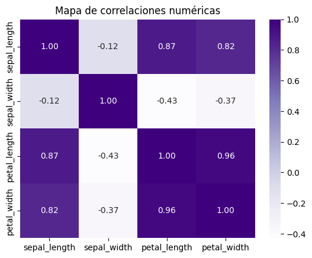
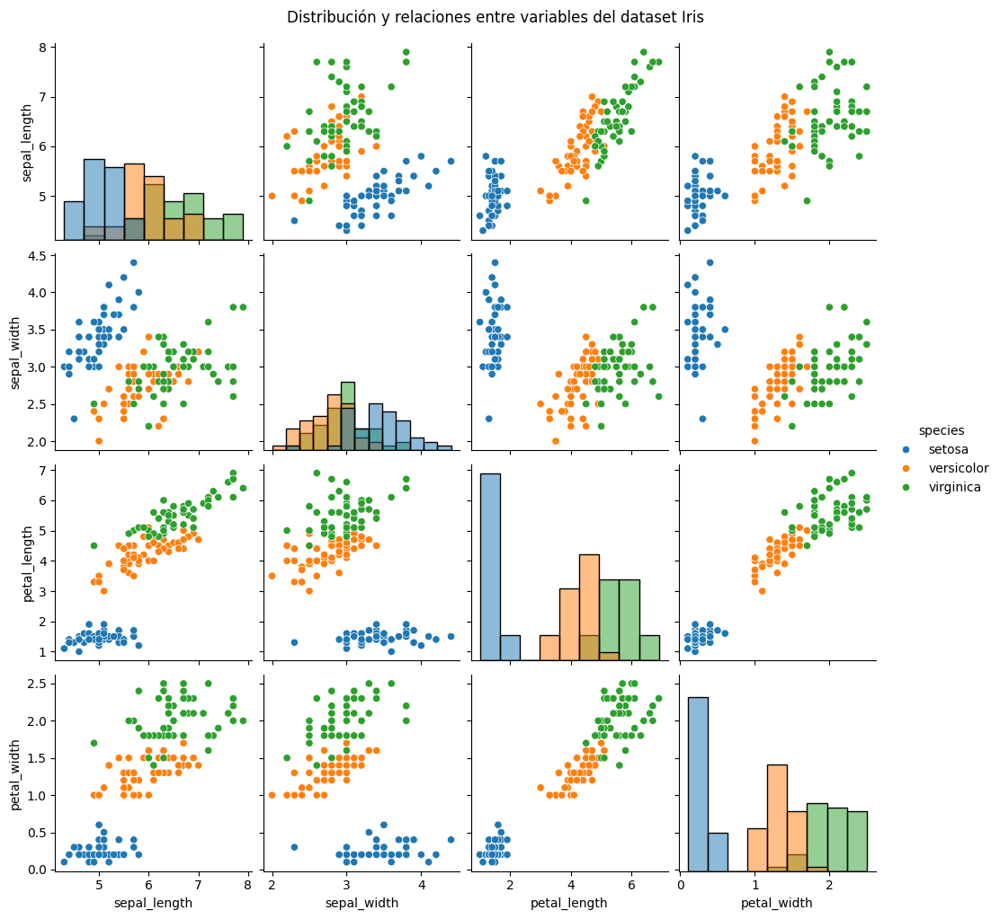
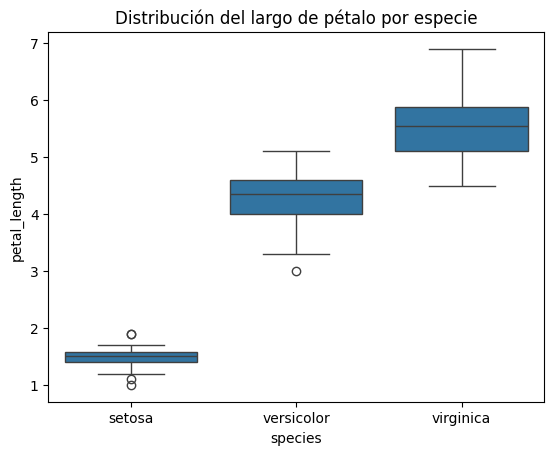

# 🌸 De pétalos y sépalos: primeras exploraciones con el dataset Iris

## Contexto  
Primera práctica del curso orientada a **cargar datos desde múltiples fuentes**, chequear **consistencia**, y realizar un **EDA básico** con visualizaciones. Se empleó el dataset clásico **Iris** para responder preguntas simples de negocio y dejar una base reproducible para prácticas futuras.

---

## Objetivos
- Verificar **equivalencia** del dataset entre varias fuentes (CSV remoto, Seaborn, scikit-learn, CSV local).  
- Describir la estructura: **dimensiones, tipos, nulos**, estadísticas básicas.  
- Explorar **correlaciones** entre variables numéricas.  
- Responder 3 **preguntas de negocio** con apoyo visual.  
- Documentar evidencias y conclusiones de forma clara.

---

## Actividades (con tiempos estimados)
- Setup de entorno y carpetas — 15 min  
- Carga y comparación multifuente — 20 min  
- Análisis descriptivo y nulos — 20 min  
- Correlaciones y visualizaciones — 25 min  
- Documentación en el portafolio — 15 min  

---

## Desarrollo

### **1. Dataset y verificación multifuente**  
Se cargó **Iris** desde cuatro orígenes:

- **df1:** CSV remoto (GitHub / seaborn-data).  
- **df2:** `sns.load_dataset("iris")`.  
- **df3:** `sklearn.datasets.load_iris(as_frame=True)` (con especies codificadas numéricamente y nombres de columnas distintos).  
- **df4:** CSV local (variantes de nombres como `SepalLengthCm`, `Species`, etc.).

**Resultado de comparación**

| Comparación | Estado | Observación clave |
|---|---:|---|
| df1 ↔ df2 | ✅ | Estructura y valores idénticos |
| df2 ↔ df3 | ❌ | Especies como enteros; nombres con “(cm)” |
| df3 ↔ df4 | ❌ | Diferente nomenclatura y formato |
| df1 ↔ df4 | ❌ | Diferencias en nombres y capitalización |

> Para el EDA se trabajó con **df1/df2** por ser equivalentes.

---

### **2. Exploración inicial (shape, tipos, nulos, resumen)**  
- **Tamaño:** 150 filas × 5 columnas.  
- **Variables:** `sepal_length`, `sepal_width`, `petal_length`, `petal_width`, `species`.  
- **Nulos:** 0 en todas las columnas.  
- **Resumen numérico (promedio y rango):**
  - `sepal_length` → **5.84** (4.3–7.9)  
  - `sepal_width` → **3.06** (2.0–4.4)  
  - `petal_length` → **3.76** (1.0–6.9)  
  - `petal_width` → **1.20** (0.1–2.5)

---

### **3. Correlaciones**  
Las variables de pétalo concentran la señal:

- `petal_length` ↔ `petal_width`: **ρ ≈ 0.96** (muy fuerte, positiva)  
- `sepal_length` ↔ `petal_length`: **ρ ≈ 0.87** (fuerte, positiva)  
- `sepal_width` muestra correlaciones **negativas moderadas** con el resto (–0.36 a –0.43).

{ width="800" }  
*Fig. 1 — Heatmap de correlaciones: fuerte asociación entre las métricas de pétalo.*

---

### **4. Visualizaciones clave**  

{ width="800" }  
*Fig. 2 — Pairplot por especie con histogramas en la diagonal y scatterplots entre variables: **setosa** aparece bien separada; **versicolor** y **virginica** tienen solapamiento parcial. Se ve la relación creciente entre largo y ancho del pétalo.*

{ width="680" }  
*Fig. 3 — Boxplot de `petal_length` por especie: **virginica** presenta los pétalos más largos; **setosa**, los más cortos.*

---

### **5. Preguntas de negocio (resultados)**

1) **¿Cuál es la especie con pétalo más largo?**  
**Virginica** (media y cuartiles superiores mayores en `petal_length`).  

2) **¿Hay relación entre largo del sépalo y del pétalo?**  
Sí, **correlación positiva fuerte** (`sepal_length` ↔ `petal_length`, ρ ≈ 0.87): a mayor sépalo, mayor pétalo.  

3) **¿Cuál es la especie con sépalo más ancho en promedio?**  
**Setosa** (promedio de `sepal_width` más alto y distribución desplazada hacia valores mayores).

---

## Evidencias  

- [Notebook completo](../recursos_files/uno_mod.ipynb)

---

## Reflexión

- La verificación **multifuente** evitó mezclar versiones incompatibles (nombres distintos y codificación de `species`).  
- Las variables de **pétalo** aportan la mayor separabilidad entre clases; la visualización lo vuelve evidente.  
- EDA temprano + chequeos de consistencia son pasos críticos para **reproducibilidad** y **calidad**.

---

## Conclusiones

- **df1/df2** son equivalentes y adecuados para análisis; **df3/df4** requieren normalización previa.  
- Las relaciones fuertes entre métricas de **pétalo** sustentan clasificaciones simples y efectivas en Iris.  
- **Setosa** se diferencia por **sépalos más anchos**; **Virginica**, por **pétalos más largos**.  
- La combinación de **resúmenes + visualizaciones** entrega respuestas claras y comunicables.

---

## Referencias

- Fisher, R. A. (1936). *The use of multiple measurements in taxonomic problems.*  
- Documentación de Seaborn y scikit-learn (datasets Iris).