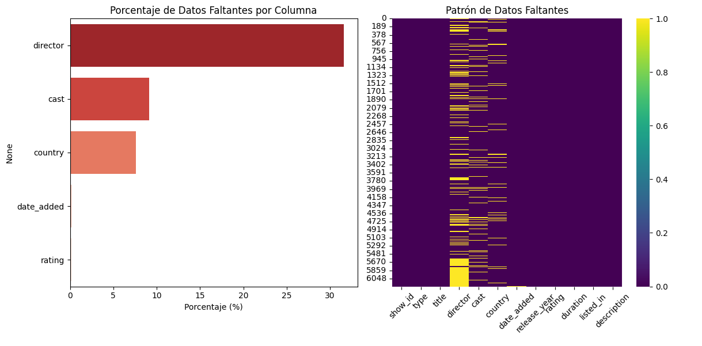
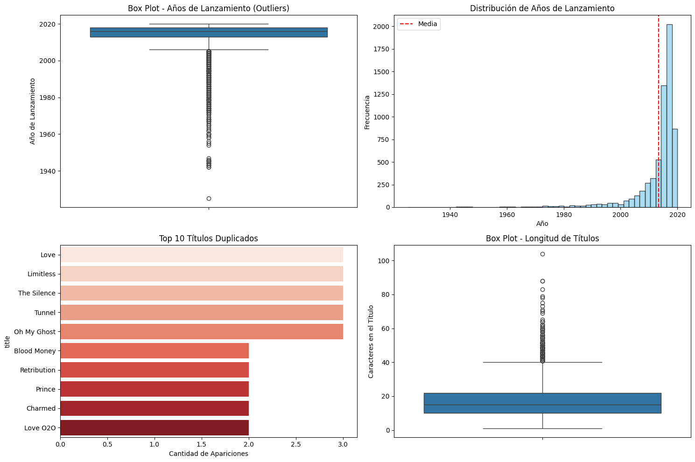
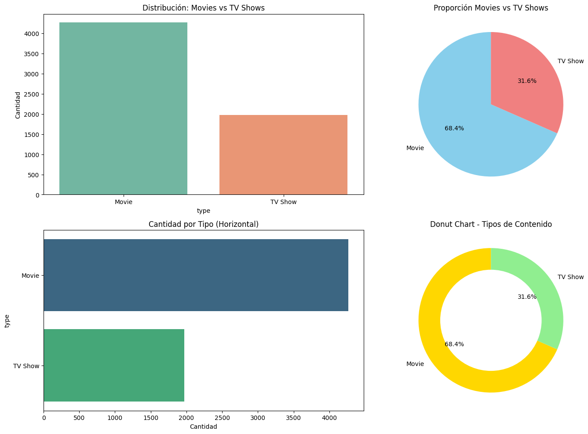
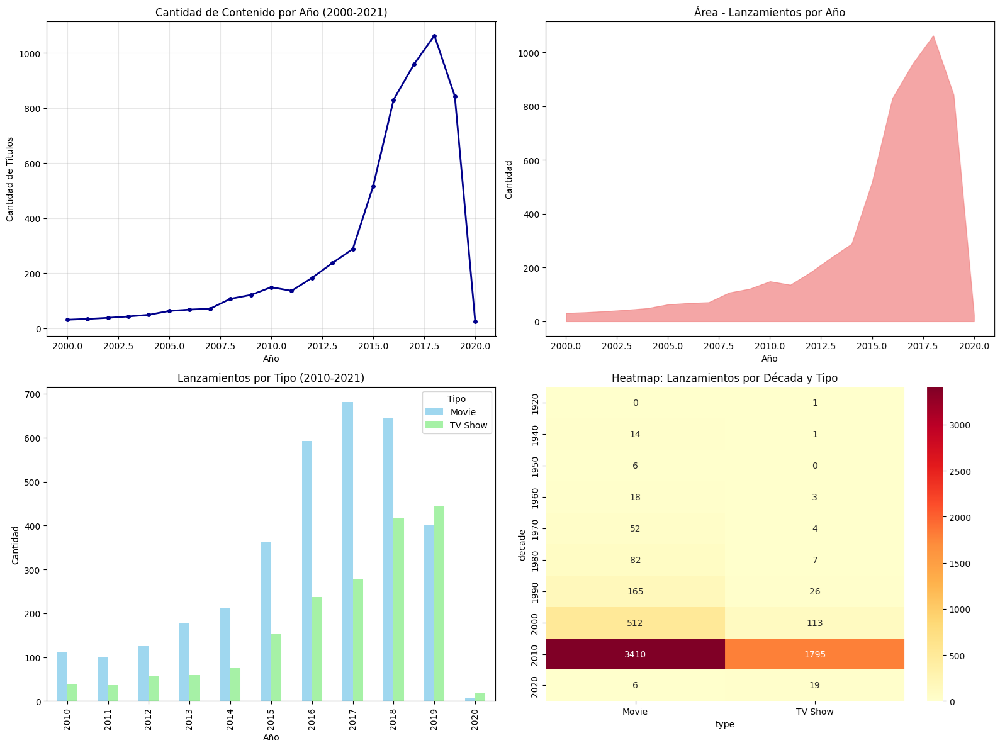
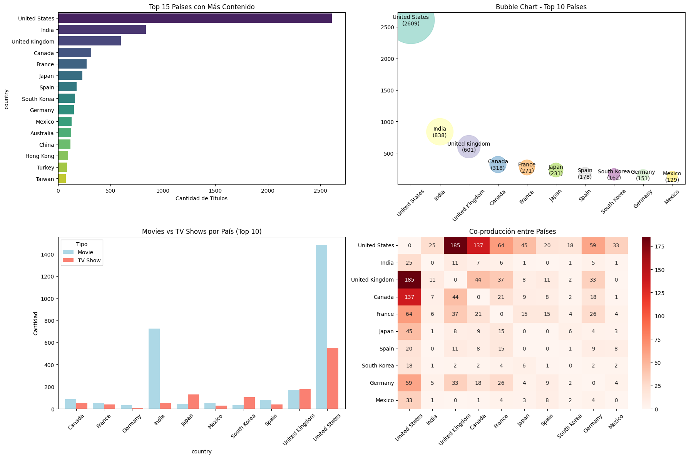
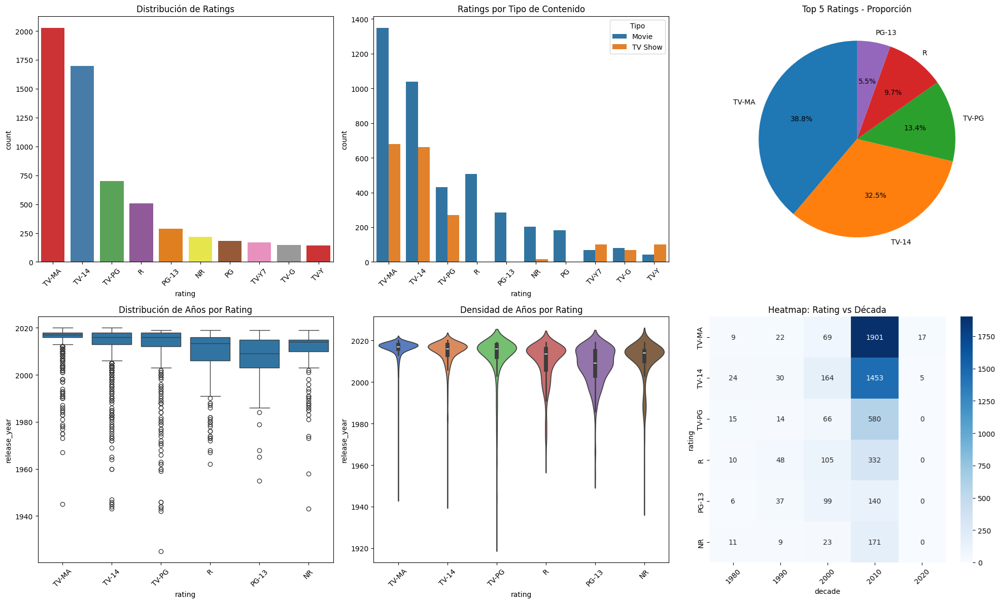
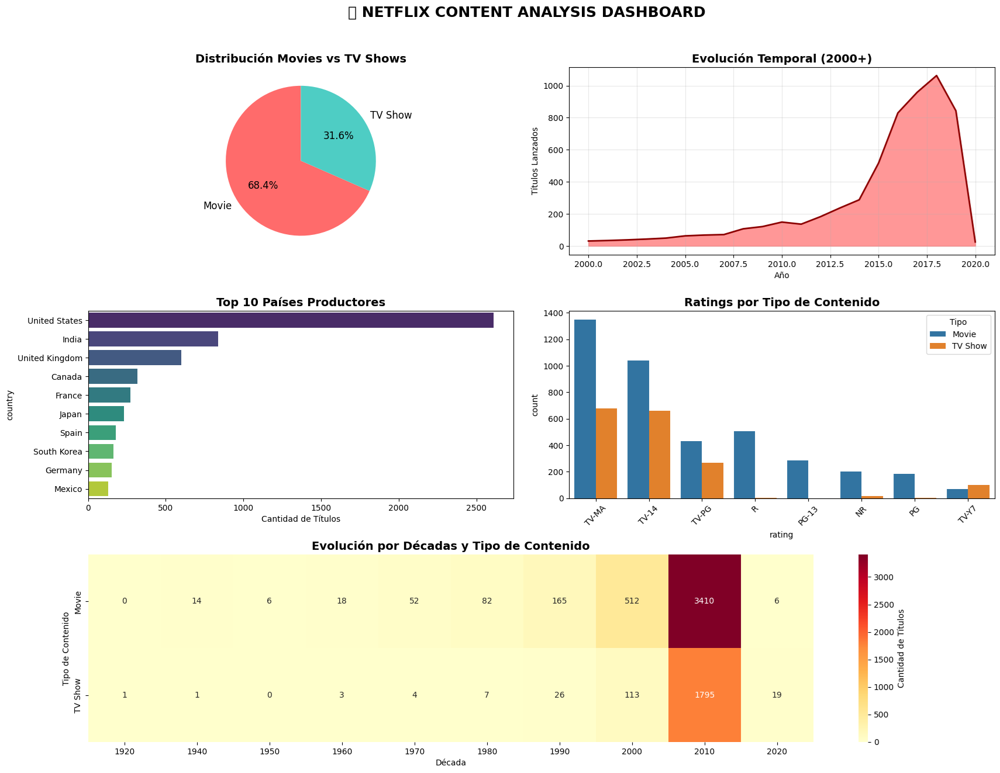
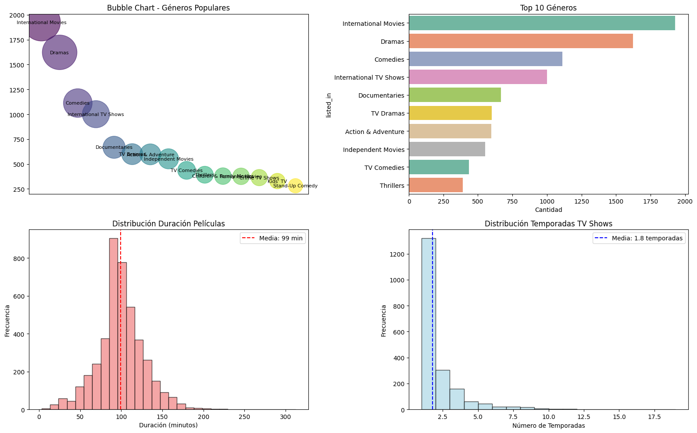

# Análisis del catálogo de Netflix

## Contexto
Trabajo de análisis de datos para explorar la evolución del catálogo de Netflix y entender tendencias por tipo de contenido, mercados y géneros.

## Objetivos
- Analizar la evolución temporal de títulos (Movies vs TV Shows).
- Identificar concentración por países/mercados.
- Detectar géneros predominantes y oportunidades.

## Actividades (con tiempos estimados)
- Recolección y limpieza — 40 min  
- Visualización y análisis — 70 min  
- Conclusiones — 30 min

## Desarrollo
Se observó un crecimiento marcado de las series desde 2017, superando a las películas. Esto sugiere un viraje estratégico hacia producciones seriadas originales.  
En mercados, EE. UU. e India concentran gran parte del catálogo; conviene diversificar con producciones locales en regiones emergentes.  
En géneros, destacan dramas, comedias y películas internacionales; se recomienda reforzar géneros transversales y explorar nichos (anime, documentales, realities).

## Evidencias
- [Notebook completo en nbviewer](https://nbviewer.org/github/naguer019/IA-portfolio/blob/main/docs/recursos_files/analysis%20parte%203%20netflix%20ing%20datos.ipynb)

### Como se hicieron y que nos dicen las visualizaciones

#### ***Detección y visualización de datos faltantes***:

**Cómo se hizo:**  
Primero se calcularon los valores faltantes por columna usando `isnull()` y se expresaron en números absolutos y porcentajes. Con esa información se generaron dos visualizaciones:  
- Un gráfico de barras horizontales (usando **seaborn**) para mostrar el porcentaje de datos faltantes en cada columna.  
- Un heatmap (también con **seaborn**) para visualizar el patrón de valores nulos a lo largo del dataset, donde cada fila representa un registro y cada columna una variable.

{ width="680" }

**Qué muestra:**  
El gráfico de barras indica que la columna con más datos faltantes es **director** (alrededor del 32% de los registros), seguida de **cast** (9%) y **country** (8%). En cambio, **date_added** y **rating** casi no tienen datos faltantes.  
El heatmap confirma este patrón: se ven franjas amarillas en esas columnas específicas, mientras que las demás están completas. Esto sugiere que, si se decide limpiar o imputar, el mayor desafío estará en la columna `director`.

#### ***Detección de outliers y anomalías***:

**Cómo se hizo:**  
Se generaron varias visualizaciones para detectar posibles valores atípicos y anomalías en el dataset:  
- Un **box plot de los años de lanzamiento** para identificar títulos con fechas poco comunes (muy antiguas o fuera de rango).  
- Un **histograma de distribución de años** con una línea roja que marca la media.  
- Un **gráfico de barras** con los 10 títulos más duplicados.  
- Un **box plot de la longitud de los títulos** para analizar títulos demasiado largos o muy cortos.

{ width="680" }

**Qué muestran:**  
El box plot de los años revela que existen unos pocos títulos muy antiguos (anteriores a 1950), aunque no hay lanzamientos con fechas futuras. El histograma confirma que la mayoría de los contenidos fueron lanzados entre 2010 y 2020, concentrándose en los años más recientes.  
El análisis de duplicados muestra que hay 57 títulos que aparecen más de una vez, con ejemplos como *Love* o *Limitless*.  
Finalmente, el box plot de longitudes muestra que la mayoría de los títulos tienen entre 10 y 20 caracteres, aunque existen casos extremos: algunos muy largos, como *Jim & Andy: The Great Beyond...*, y otros muy cortos, como *PK* o *ATM*.  

#### ***Analisis de tipos de contenido***:

**Cómo se hizo:**  
Se calcularon las frecuencias de cada tipo de contenido (`Movie` y `TV Show`) con el método `value_counts()`.  
Luego, se generaron distintas visualizaciones para mostrar esta distribución:  
- Un gráfico de barras vertical con **seaborn**.  
- Un **gráfico circular (pie chart)** que muestra porcentajes.  
- Un gráfico de barras horizontal para comparar en otra orientación.  
- Un **donut chart**, que es una variación del pie chart con un círculo blanco en el centro.

{ width="680" }

**Qué muestran:**  
Los resultados indican que la mayoría del catálogo corresponde a **películas (68%)**, mientras que las **series representan alrededor del 32%**.  
Las distintas formas de graficar confirman la misma conclusión: Netflix tiene casi el doble de películas que de programas de TV.  

#### ***Analisis de tendencias temporales***:

**Cómo se hizo:**  
Se prepararon los datos de lanzamiento convirtiendo los años a valores numéricos y agrupando por frecuencia.  
Luego se generaron varias visualizaciones:  
- Una **línea temporal** que muestra la cantidad de lanzamientos por año desde el 2000.  
- Un **área bajo la curva** que resalta la tendencia de crecimiento.  
- Un **gráfico de barras por tipo de contenido** (películas y series) entre 2010 y 2021.  
- Un **heatmap por década y tipo** que muestra en qué periodos se concentraron más lanzamientos.

{ width="680" }

**Qué muestran:**  
Las gráficas indican un crecimiento sostenido de lanzamientos desde el 2000, con un pico entre **2017 y 2018**, cuando se superaron los 1000 estrenos en un año.  
El desglose por tipo confirma que las **películas dominaron en cantidad**, aunque las series tuvieron un crecimiento notable a partir de 2015.  
El heatmap muestra que la década 2010–2020 fue, por lejos, la de mayor producción tanto de películas (más de 3400) como de series (casi 1800).  
En 2020 se observa una caída brusca en la cantidad de estrenos, probablemente vinculada a la pandemia y sus efectos en la industria audiovisual.

#### ***Analisis de paises con mas visualizaciones***:

**Cómo se hizo:**  
Se limpió la columna de países, separando aquellos casos donde había varios países en una misma fila.  
Con esa información se realizaron distintas visualizaciones:  
- Un **gráfico de barras horizontal** con los 15 países con más títulos en el catálogo.  
- Un **bubble chart** que representa los 10 principales países en tamaño y cantidad de títulos.  
- Un **gráfico de barras agrupadas** para comparar películas y series en los 10 países más relevantes.  
- Un **heatmap de co-producción**, que muestra cuántas veces dos países aparecen juntos en una misma producción.

{ width="680" }

**Qué muestran:**  
El análisis confirma que **Estados Unidos** domina ampliamente el catálogo, con más de 2500 títulos, seguido de **India** (838) y **Reino Unido** (601).  
Otros países como Canadá, Francia y Japón también tienen una presencia considerable, aunque mucho menor en comparación con los tres principales.  
La comparación por tipo de contenido revela que en casi todos los países predominan las **películas**, aunque en algunos como Corea del Sur y Japón las series también tienen un peso importante.  
El heatmap evidencia que Estados Unidos es el país con más **co-producciones internacionales**, especialmente con Reino Unido y Canadá, lo cual refleja su papel central en la industria global del entretenimiento.

#### ***Analísis de ratings y géneros***:

**Cómo se hizo:**  
Se contaron los valores más frecuentes en la columna `rating` y se seleccionaron los 10 principales.  
Con esta información se generaron varias visualizaciones:  
- Un **gráfico de barras** mostrando la distribución de ratings más comunes.  
- Un **gráfico de barras segmentado por tipo de contenido** (películas y series).  
- Un **gráfico circular (pie chart)** con la proporción de los 5 ratings más frecuentes.  
- Un **box plot** y un **violin plot** para analizar la distribución de años de lanzamiento según el rating.  
- Un **heatmap** que cruza ratings con décadas, mostrando en qué periodos cada clasificación fue más frecuente.

{ width="680" }

**Qué muestran:**  
Los ratings más comunes son **TV-MA** (contenido para adultos) y **TV-14**, que juntos concentran más del 70% del catálogo.  
Al diferenciar por tipo, se observa que **TV-MA predomina en películas**, mientras que **TV-14 es muy común en series**.  
Los boxplots y violin plots confirman que la mayor parte de los contenidos clasificados en estas categorías fueron lanzados después de 2010.  
Finalmente, el heatmap evidencia que en la década de 2010 los ratings **TV-MA y TV-14** se consolidaron como los más utilizados, en contraste con décadas anteriores donde eran más frecuentes otras clasificaciones como PG o R.

#### ***Dashboard interactivo***:

**Cómo se hizo:**  
Se calcularon métricas generales (total de títulos, % de películas/series y rango de años).  
Con **matplotlib** y **seaborn** se armó un dashboard usando `GridSpec` (3 filas × 4 columnas) con estos paneles:
- **Pie chart**: proporción `type` (Movie vs TV Show) a partir de `value_counts()`.
- **Área + línea temporal**: lanzamientos por año desde 2000 usando `groupby('release_year').size()`.
- **Barras horizontales**: *Top 10* países; se limpió `country`, se separaron países por coma y se usó `value_counts()`.
- **Barras por rating y tipo**: conteo de `rating` con `hue='type'`.
- **Heatmap por década y tipo**: se creó `decade = (release_year // 10) * 10` y se graficó `groupby(['decade','type']).size()`.

El dashboard se guarda como **`netflix_dashboard.png`**.

{ width="680" }

**Qué muestra:**  
- **Distribución**: el catálogo es ~**68% películas** y ~**32% series**.  
- **Evolución temporal**: fuerte crecimiento desde 2010, pico en **2017–2018** (>1000 lanzamientos) y caída en **2020**.  
- **Países**: **Estados Unidos** lidera ampliamente en cantidad de títulos, seguido por **India** y **Reino Unido**.  
- **Ratings**: predominan **TV-MA** y **TV-14**; TV-MA aparece más en películas y TV-14 es muy frecuente en series.  
- **Décadas**: la **2010s** concentra la mayor producción para ambos tipos (películas por encima de series), confirmando el impulso más reciente del catálogo.

#### ***Análisis avanzado de géneros***:

**Cómo se hizo:**  
Se desglosó la columna `listed_in` para separar múltiples géneros de cada título y se contaron las frecuencias.  
Con esos datos se realizaron varias visualizaciones:  
- Un **bubble chart** para representar los géneros más populares.  
- Un **gráfico de barras horizontal** con el *Top 10* géneros.  
- Un **histograma de duración de películas** (en minutos), incluyendo la media.  
- Un **histograma de temporadas de series**, también marcando la media en temporadas.

{ width="680" }

**Qué muestran:**  
Los géneros más frecuentes en Netflix son **International Movies**, **Dramas** y **Comedies**, seguidos por *International TV Shows* y *Documentaries*.  
La duración promedio de las películas es de **99 minutos**, aunque hay casos extremos: desde cortos de apenas 3 minutos hasta producciones de más de 300 minutos.  
En el caso de las series, la mayoría tiene entre **1 y 2 temporadas**, con un promedio de **1.8 temporadas**, aunque algunas llegan hasta **15 temporadas**.  
Esto refleja que Netflix combina películas de extensión típica con series mayormente cortas, lo que encaja con el modelo de consumo rápido y variado de su audiencia global.

## Reflexión
Cruzar catálogo con métricas de consumo (horas vistas/usuarios), ratings externos y datos financieros permitiría estimar ROI por género/país y priorizar inversión.  
Agregar benchmark con competidores daría contexto estratégico.

### Preguntas a responder luego de los análisis
1.  ¿Qué tipo de visualización es más efectiva para mostrar distribuciones temporales?

2. ¿Por qué usamos diferentes tipos de gráficos para diferentes datos?

3. ¿Qué insights de negocio obtuviste que Netflix podría usar?

4. ¿Cuál fue la visualización más reveladora y por qué?

5. ¿Cómo mejorarías este análisis con más datos?

### Respuestas 
1. La visualización más clara es el area plot, ya que permite apreciar de manera directa y efectiva la variación de los datos a lo largo del tiempo. En segundo lugar se encuentra el line plot, que también refleja bien la tendencia, aunque con menor impacto visual. Finalmente, el bar plot resulta menos adecuado, dado que dificulta percibir la continuidad temporal de los datos.

2. La elección del tipo de gráfico depende directamente de lo que se busque resaltar en el análisis. En otras palabras, ciertas visualizaciones se adaptan mejor a determinados objetivos de comunicación y, por lo tanto, es recomendable seleccionarlas en función del mensaje que se desea transmitir. Por ejemplo, los heatmaps resultan especialmente útiles para detectar patrones, zonas de interés, puntos de fricción u oportunidades de mejora. A esto se suma la influencia de la psicología del color, ya que la escala cromática elegida puede modificar la interpretación del observador. Un heatmap en tonos rojos o cálidos, por ejemplo, suele asociarse a algo negativo o problemático en la medida que aumenta la intensidad del color, mientras que una escala en tonos fríos puede transmitir la percepción opuesta.

3. Considero que estos serían unos buenos puntos en los que netflix podría intentar avanzar:
   
    Estrategia de contenido por tipo:
    El catálogo refleja un crecimiento marcado de las series a partir de 2017, lo que indica que Netflix debería continuar apostando por producciones seriadas, ya que han sido motor clave de su expansión.
    En cuanto a las películas, aunque mantienen relevancia, su crecimiento es más estable; en este caso, la estrategia más conveniente sería concentrarse en grandes producciones (blockbusters) en géneros de alta demanda.

    Mercados objetivo:
    Estados Unidos e India concentran la mayor parte de los títulos, lo que evidencia una fuerte dependencia de estos mercados. Para mitigar riesgos y ampliar su base de suscriptores, Netflix debería diversificar sus producciones locales en mercados emergentes como Latinoamérica, África y Europa del Este.

    Géneros predominantes:
    Dramas, comedias y películas internacionales lideran el catálogo. Esto sugiere la conveniencia de reforzar géneros universales, pero también de explotar nichos con menor saturación, como el anime, los documentales o los realities.

4. La visualización de la evolución de títulos por año (Movies vs. TV Shows) resultó la más significativa. El hallazgo clave fue el aumento abrupto de series a partir de 2017, superando el crecimiento de películas.
Este cambio confirma una transformación en la estrategia de Netflix: pasó de ser un distribuidor principalmente de películas a consolidarse como productor de contenido seriado original, lo cual fue determinante para diferenciarse de competidores como HBO o Amazon Prime.

5. Posibles mejoras con más datos

    Audiencia real: cruzar el catálogo con métricas de consumo (horas vistas, número de usuarios únicos) permitiría verificar si los géneros con mayor oferta son también los más demandados.

    Calidad percibida: integrar ratings externos (IMDb, Rotten Tomatoes) posibilitaría evaluar la calidad frente al volumen de producción.

    Datos financieros: considerar presupuestos y retornos estimados ayudaría a calcular el ROI por género o país, información valiosa para definir prioridades de inversión.

    Análisis competitivo: incorporar datos de catálogos de Prime, Disney+, entre otros, permitiría un benchmark para identificar ventajas y debilidades frente a la competencia.
   
## Referencias
- Dataset: *Netflix Titles* (Kaggle)  
- Documentación de visualización en Python
