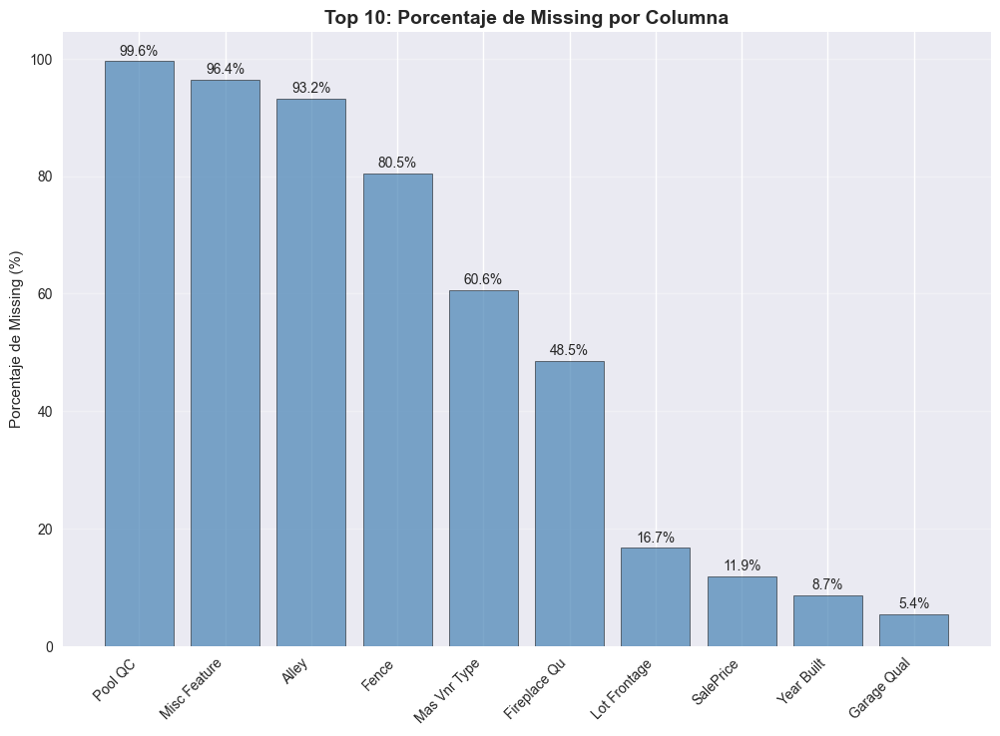
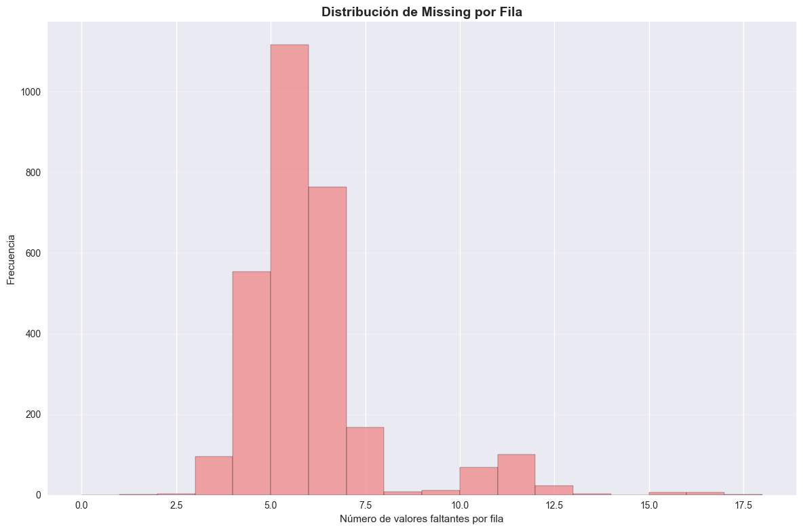
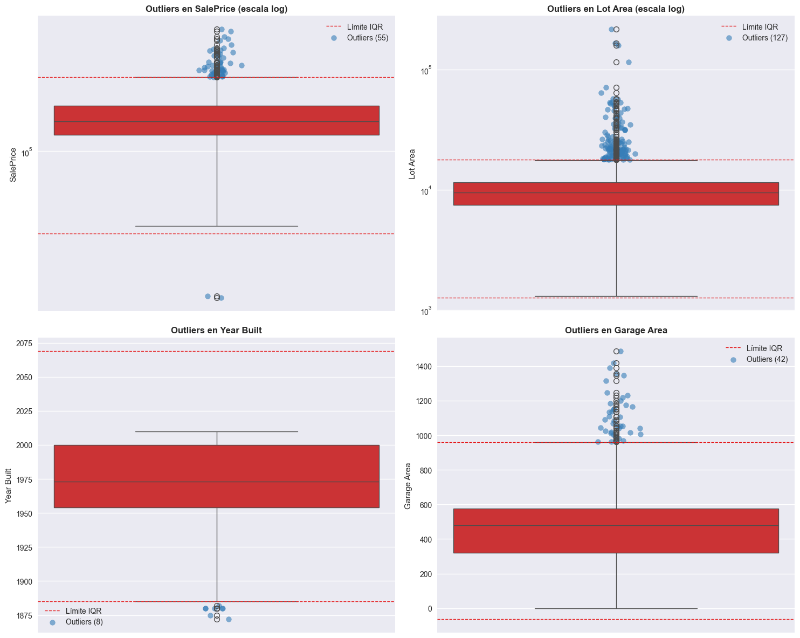
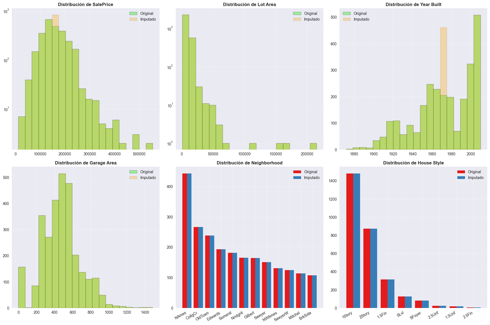
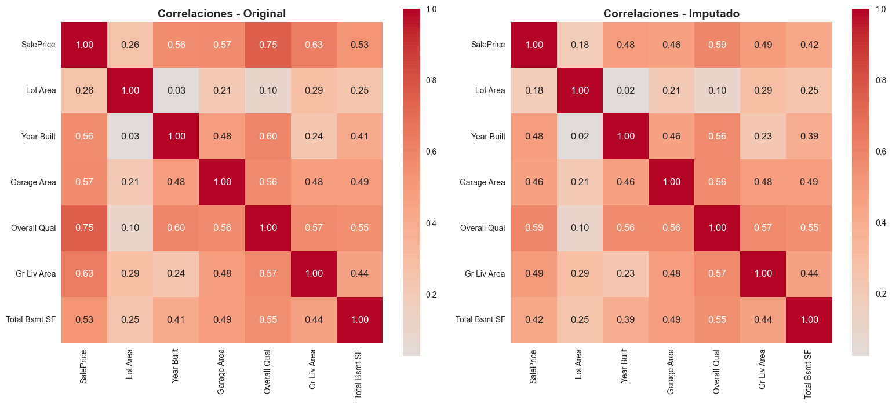

# 🕵️‍♂️ Detectives de datos: hallando y reparando valores perdidos en Ames Housing

## Contexto
Práctica centrada en **diagnóstico y tratamiento de datos faltantes** y **outliers** sobre el dataset **Ames Housing** (2.930 filas, 82 columnas). Se simularon faltantes MCAR/MAR/MNAR para ejercitar decisiones de imputación y se armó un **pipeline anti-leakage** reproducible.

## Objetivos
- Identificar **qué columnas** presentan missing y **de qué tipo** (MCAR/MAR/MNAR).
- Detectar **outliers** con IQR y Z-score y visualizarlos.
- Implementar **imputación simple** y una imputación **“smart”** basada en reglas de negocio.
- Comparar **distribuciones y correlaciones** antes/después de imputar.
- Preparar un **preprocesamiento anti-leakage** (split → fit en train → transform en valid/test) con `sklearn.Pipeline`.

## Actividades (con tiempos estimados)
- Setup + carga de datos — **10 min**  
- Exploración básica (tipos, memoria, duplicados) — **20 min**  
- Análisis de missing (top-10 y por fila) — **25 min**  
- Detección de outliers (IQR, Z) — **30 min**  
- Imputación simple y “smart” — **45 min**  
- Comparación de distribuciones/correlaciones — **25 min**  
- Split anti-leakage + pipeline — **25 min**  
- Redacción y publicación en el portfolio — **20 min**

---

## Desarrollo

### Cargar dataset
- Dataset original: **AmesHousing.csv** (2.930 × 82).
- Se creó **missing sintético** para ejercitar:
  - **Year Built (≈8%)** → MCAR.
  - **Garage Area** faltante condicionado a *Garage Type* → MAR.
  - **SalePrice** con mayor prob. de NA en precios altos (>p85) → MNAR.

### Exploración básica
- `df.info()`, `df.describe()`, `df.dtypes`  
- Memoria total ~**7.8 MB**; 43 variables categóricas, 39 numéricas.  
- **Duplicados**: 0.

---

## Evidencias

- [Notebook completo](../recursos_files/cuatro_prac_5.ipynb)

### Missing: Top-10 por columna y NA por fila
**Cómo**: `isnull().sum()` y % sobre 2.930 filas.  
**Qué muestra**: `Pool QC` (99.6%), `Misc Feature` (96.4%), `Alley` (93.2%), `Fence` (80.5%), `Mas Vnr Type` (60.6%), `Fireplace Qu` (48.5%), `Lot Frontage` (16.7%), `SalePrice` (11.9%), `Year Built` (8.7%).  
La mayoría de filas acumula **5–7** NAs.

{ width="760" }

{ width="760" }
*(La segunda figura del script muestra la distribución de NA por fila.)*

---

### Clasificación MCAR/MAR/MNAR
- **Year Built → MCAR**: faltantes distribuidos al azar; sin patrón por *Neighborhood* ni *House Style*.  
- **Garage Area → MAR**: NA asociado a *Garage Type* (p. ej., *None*).  
- **SalePrice → MNAR**: mayor probabilidad de NA en **precios altos**.  
- **Pool QC / Fireplace Qu / Fence** → **MNAR estructural** (ausencia real del atributo).

---

### Outliers (IQR y Z-score)
**Cómo**: IQR (`Q1±1.5×IQR`) y Z-score (|z|>3).  
**Resultados**:
- `SalePrice`: IQR **55 (1.9%)**, Z **29 (1.0%)**  
- `Lot Area`: IQR **127 (4.3%)**, Z **29 (1.0%)**  
- `Year Built`: IQR **8 (0.3%)**, Z **7 (0.2%)**  
- `Garage Area`: IQR **42 (1.4%)**, Z **17 (0.6%)**

{ width="760" }

**Lectura**: IQR capta mejor **colas largas** (ej. *Lot Area*); Z-score es más conservador si la dist. no es gaussiana.

---

### Imputación simple (baseline)
- **Numéricas** → **mediana** (robusta a outliers).  
- **Categóricas** → **moda** (o “Unknown”).  
- Resultado: **0** NA restantes (baseline para comparar).

### Imputación “smart” (reglas de negocio)
- `Year Built`: mediana por *(Neighborhood, House Style)* → por *Neighborhood* → global (redondeo a entero).  
- `Garage Area`: flag `GarageArea_was_na`. Si `Garage Cars=0` ⇒ **área=0**. Resto: mediana por barrio.  
- `SalePrice` (opcional): mediana por barrio.  
- `Garage Type`: moda (o “Unknown”).  

**Motivo**: conservar **coherencia semántica** (no inventar garajes) y **heterogeneidad** por barrio/estilo.

---

### Comparación de distribuciones (antes vs después)
{ width="760" }

**Lectura**:
- Con **mediana** no se “aplasta” tanto la cola de *Lot Area*/*SalePrice* vs media.  
- Reglas “smart” evitan desplazar artificialmente la masa (ej. `Garage Area=0` donde corresponde).

---

### Correlaciones: original vs imputado
{ width="760" }

**Δ (Imputado − Original)** — extracto:
- `SalePrice ~ Overall Qual`: **−0.165**  
- `SalePrice ~ Gr Liv Area`: **−0.141**  
- `SalePrice ~ Garage Area`: **−0.105**  
- `SalePrice ~ Year Built`: **−0.078**  

**Conclusión**: la imputación **diluye algunas relaciones**; por eso conviene reglas por **barrio/estilo** y documentar.

---

### Anti-Leakage: split y luego transformar
- Split: Train **1.758**, Valid **586**, Test **586**.  
- `SimpleImputer` **fit solo en train** → `transform` en valid/test.  
- **Justificación**: evitar “espiar el examen” con estadísticas globales.

### Pipeline reproducible (`sklearn`)
`ColumnTransformer`:
- Num: `SimpleImputer(strategy='median')` + `StandardScaler`  
- Cat: `SimpleImputer(strategy='most_frequent')` + `OneHotEncoder(handle_unknown='ignore')`

**Salida de `fit_transform`**: `(2930, 46)` en `scipy.sparse.csr_matrix`.

---

## Reflexión
- **IQR** > Z-score frente a **colas largas**; Z es correcto en escenarios ~normales.  
- Mediana como imputador numérico fue **estable**; “smart rules” mejoraron **coherencia** (ej. garajes).  
- La imputación **modifica correlaciones**; validar aguas abajo con CV.  
- **Anti-leakage** es obligatorio: *split → fit(train) → transform(valid/test)*. `Pipeline` deja traza y evita errores.

## Preguntas y respuestas

**1. ¿Tipo de missing por columna?**  
- *Year Built* MCAR; *Garage Area* MAR; *SalePrice* MNAR; atributos como *Pool QC* MNAR estructural.

**2. ¿Por qué esas imputaciones? Alternativas.**  
- Mediana (robusta). Moda/“Unknown” en categóricas. Alternativas: KNN/Regresión/MICE (más costo y riesgo de leakage).

**3. Impacto por grupos (barrios, estilos).**  
- Imputar global **sesga** barrios; usar mediana por **Neighborhood/House Style** reduce el sesgo.

**4. Info extra para outliers.**  
- Tasaciones externas, metadatos de medición, contexto geográfico/temporal.

**5. Reproducibilidad y transparencia.**  
- `Pipeline` versionado, flags de imputación, seeds fijos, documentación de umbrales y porqués.

## Referencias
- Dataset **Ames Housing** (Kaggle).  
- scikit-learn docs: `SimpleImputer`, `ColumnTransformer`, `Pipeline`.  
- Little & Rubin — MCAR/MAR/MNAR.