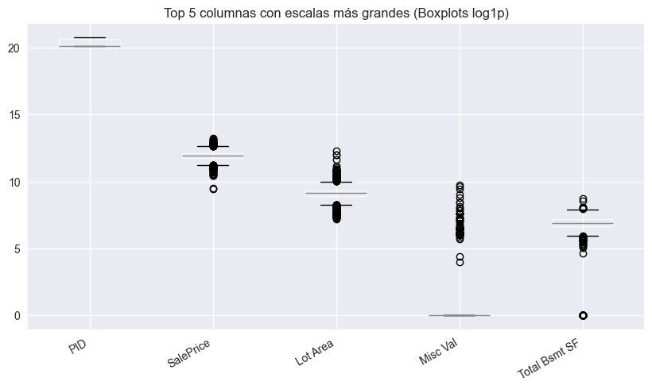
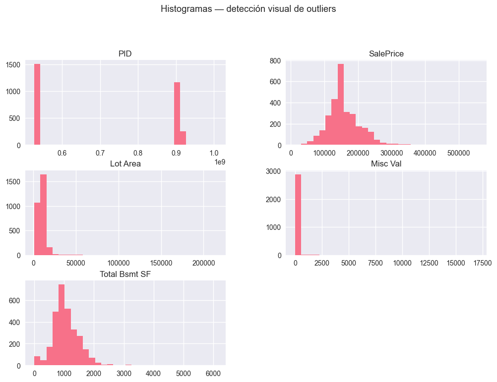
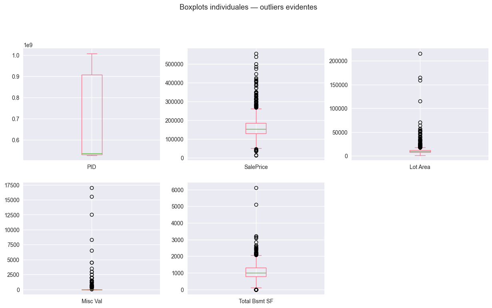
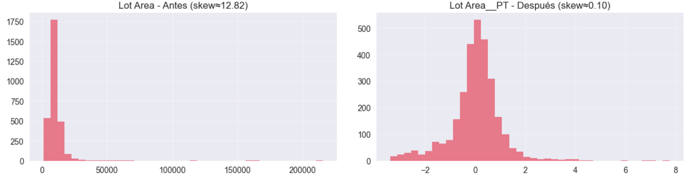

# Escalado, Outliers y Pipelines (Ames Housing)

## Contexto
Práctica de Ingeniería de Datos enfocada en **preprocesamiento numérico**: detección de outliers, efecto del **escalado de features**, elección de transformadores y **prevención de data leakage** al construir pipelines reproducibles. Se trabajó con el dataset **Ames Housing** (2930 filas, 82 columnas). Se introdujeron faltantes sintéticos para ejercitar imputación y análisis de sesgo.

## Objetivos
- Identificar cuáles features del dataset Ames **necesitan escalado** y por qué.  
- Experimentar con **MinMaxScaler, StandardScaler y RobustScaler** en datos reales.  
- Descubrir el **impacto del escalado** en diferentes algoritmos mediante experimentación.  
- Comparar **pipelines con y sin data leakage** para ver las diferencias.  
- Decidir **la mejor estrategia** basándose en evidencia empírica.

## Actividades (con tiempos estimados)
- Preparación de entorno y dataset — **25 min**  
- Exploración inicial (escalas, outliers, ratios) — **55 min**  
- Experimentos con escalers clásicos (Standard/MinMax/Robust) — **45 min**  
- Trabajo independiente con transformador avanzado (**PowerTransformer – Yeo-Johnson**) — **45 min**  
- Demostración anti-leakage (método incorrecto, correcto y **Pipeline**) — **40 min**  
- Validación con **cross-validation** y baseline — **35 min**  
- Redacción de evidencias y conclusiones — **40 min**  
- Subida y formateo para el portfolio — **40 min**

---

## Desarrollo
1. **Exploración y escalas.** Se calcularon rangos y ratios *max/min* por columna y se graficaron **boxplots en log1p** e **histogramas**. Emergieron como variables problemáticas: `Lot Area`, `Misc Val`, `Total Bsmt SF` y `SalePrice` (colas largas y fuerte asimetría).  
2. **Outliers.** Se aplicaron **IQR** y **Z-Score** (umbral=3) a los datos originales y luego a los datos escalados con tres scalers.  
3. **Transformador avanzado.** Se evaluó **PowerTransformer (Yeo-Johnson)** para corregir asimetría (no lineal, aprende λ por máxima verosimilitud).  
4. **Leakage.** Se compararon tres flujos:  
   - ❌ Escalar todo y después *train/test split* (con leakage).  
   - ✅ Split primero y escalar **solo con train** (sin leakage).  
   - ✅ `sklearn.Pipeline` (anti-leakage automático).  
5. **Validación.** Se montó un pipeline (**PowerTransformer + KNN**) y se evaluó con **CV=5** y baseline (`DummyRegressor`).

---

## Evidencias

### 1) Exploración de escalas (ratios y outliers visuales)

**Cómo se hizo**  
- Cálculo de **rango** y **ratio `max/min`** por columna numérica.  
- **Boxplots con `np.log1p`** para comparar escalas y ver colas largas.  
- **Histogramas** para confirmar sesgo y valores extremos.

**Qué muestran**  
- Top escalas "notorias" o "fuertes": `PID` (ID, descartado como feature), `Lot Area`, `Misc Val`, `Total Bsmt SF`, `SalePrice`.  
- **Ratios altos** y colas largas → riesgo para algoritmos basados en distancia (KNN/SVM).

{ width="720" }  
{ width="720" }

---

### 2) Outliers antes/después de escalar

**Cómo se hizo**  
Se midió el conteo de outliers con **IQR** y **Z-Score** en:
- Datos **originales**.  
- Datos escalados con **StandardScaler**, **MinMaxScaler** y **RobustScaler**.

**Resultados (ej. en `Lot Area`)**  
- **IQR (original):** 127 outliers  
- **Z-Score (original):** 29 outliers  
- **Post-Standard:** IQR 127 / Z 29  
- **Post-MinMax:** IQR 127 / Z 29  
- **Post-Robust:** IQR 127 / Z 29  

**Interpretación**  
- El escalado **no cambia qué puntos caen fuera de los umbrales** IQR/Z para esta columna; **sí** modifica la **representación** (menos “dominancia” visual).  
- **RobustScaler** reduce la influencia de extremos (mediana/IQR), pero no corrige **asimetría**.

{ width="720" }

---

### 3) Transformador avanzado — PowerTransformer (Yeo-Johnson) (hecho en investigación independiente)

**Cómo se hizo**  
- Apliqué `PowerTransformer(method="yeo-johnson", standardize=True)` a `Lot Area`, `Misc Val`, `Total Bsmt SF`, `SalePrice`.  
- Comparé **skewness/kurtosis** y rangos **antes vs después**.

**Qué muestran**  
- **Reducción fuerte de asimetría** y compresión de colas en las cuatro columnas.  
- A diferencia de los scalers lineales, Yeo-Johnson **cambia la forma de la distribución**.

{ width="720" }

**Nota teórica**  
Yeo-Johnson aplica una transformación de potencia **no lineal** que admite \(x \le 0\) y estima un \(\lambda\) por máxima verosimilitud. (Incluí en el notebook la ecuación completa en LaTeX en lugar de aquí para no sobrecargar).

**¿Cómo funciona?**

Funcionamiento (para Yeo-Johnson): 

1. Se estima un parámetro $\lambda$ automáticamente con máxima verosimilitud para cada feature. Ese parámetro es el que "mejor normaliza" la distribución.

2. Los valores positivos y negativos se tratan diferente:
    - Para x $\ge$ 0, es bastante parecido a Box-Cox (método solo para mayores o iguales a 0)
    - Para x $<$ 0, se usa otra fórmula para asegurar la continuidad.

3. El resultado es que los datos transformados tienen asimetría reducida (skew apróximadamente 0) y una varianza más estable.

**Razones para elegir PowerTransformer**

- Diferenciándose de StandardScaler, que solo centra y escala, PowerTransformer corrige la asimetría de las distribuciones. Siendo útil en el dataset actual de Ames Housing al tener variables como SalePrice o Lot Area que presentan colas largas y outliers que distorsionan modelos sensibles a la normalidad.

- Como ventaja principal, permite que los datos se parezcan más a una distribución normal, lo cual mejora el desempeño de los modelos lineales y algoritmos basados en supuestos gaussianos (como regresión lineal, PCA, etc).

- Métodos disponibles:
    * Box-Cox (solo valores positivos)
    * Yeo-Johnson (acepta negativos y ceros)

- Como limitaciones, por ejemplo, no siempre mejora los resultados si la variable ya está cerca de ser normal. Pudiendo también dificultar la interpretabilidad, ya que los valores transformados dejan de representar magnitudes reales como "precio en dólares" o "metros cuadrados".

- Dando un ejemplo con el dataset que estuvimos trabajando, en Ames Housing, aplicar PowerTransformer sobre SalePrice o LotArea ayuda a reducir el sesgo positivo y facilita la comparación entre viviendas de distinto rango de precios o tamaños de terreno.

---

### 4) Demostración de **data leakage**

**Configuración**  
Modelo **KNN (k=5)**, features: `Lot Area`, `Misc Val`, `Total Bsmt SF` (sin IDs). Comparación de tres flujos.

**Resultados**

| Método                     | R²     | MAE     |
|---------------------------|--------|---------|
| **Con leakage**           | 0.1846 | 36,914  |
| **Sin leakage**           | 0.1957 | 36,443  |
| **Pipeline (correcto)**   | 0.1957 | 36,443  |
| Baseline (Dummy median)   | −0.0443| 39,416  |

**Qué muestra**  
- El leakage alteró las métricas (ΔR² ≈ **+0.011**, ΔMAE ≈ **−472**). En este dataset el impacto fue **pequeño pero real**; en otros puede inflarlas mucho más.  
- **Pipeline** garantiza el orden correcto (**fit en train** → **transform en train/test**) y se integra con **cross-validation**.

---

### 5) Validación final con *cross-validation*

**Pipeline final**: `PowerTransformer (Yeo-Johnson) + KNN`  
**CV=5 (R² y MAE):**

- **R² folds:** `[0.0340, 0.1525, 0.1490, 0.0223, 0.2254]` → **media=0.1166 ± 0.0773**  
- **MAE folds:** `[38486.15, 33607.41, 30842.81, 34818.02, 32191.66]` → **media=33,989 ± 2,615**

**Baseline (Dummy median, CV=5):**  
- **R²:** media ≈ **−0.0248**  
- **MAE:** media ≈ **35,194**

**Conclusión**  
El pipeline supera claramente al baseline → **aporta valor real**. El R² aún es modesto: hay margen para mejorar con más features y modelos.

---

## Conclusiones
- **PowerTransformer (Yeo-Johnson)** fue el mejor para variables con **sesgo y colas largas** (Ames las tiene).  
- El **orden importa**: analizar/mitigar outliers **antes** de escalar.  
- **Scalers lineales** (Standard/MinMax/Robust) no cambian la forma; Yeo-Johnson sí.  
- **Pipeline + CV** evita leakage y da evaluación honesta.  
- Pipeline final (**Yeo-Johnson + KNN**) > baseline en R² y MAE.

---

## Recomendación final (pipeline)
1. **Detección/tratamiento de outliers** en crudo (IQR/Z + criterio de dominio).  
2. **Train/Test split** al inicio.  
3. **PowerTransformer (Yeo-Johnson)** para features sesgadas; StandardScaler para el resto.  
4. **Modelo sensible a escala** (p.ej., KNN/SVM) dentro de **`Pipeline`**.  
5. **Cross-validation** y baseline para contrastar.

---

## Referencias
- Dataset: **Ames Housing** (Kaggle).  
- `scikit-learn` — `StandardScaler`, `MinMaxScaler`, `RobustScaler`, `PowerTransformer`, `Pipeline`, `cross_val_score`.  
- Apuntes de la práctica 05 (outliers) y práctica 06 (escalado/leakage).
