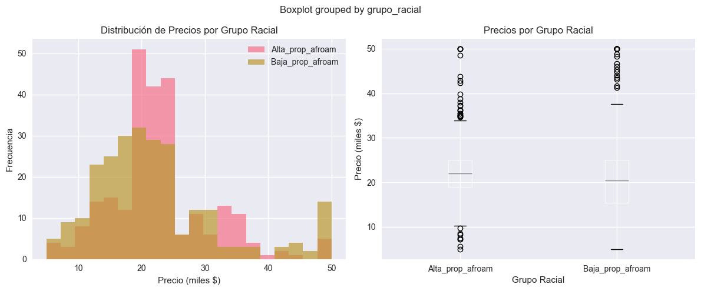

# ⚖️ Práctica 7 — Sesgo y Fairness con Fairlearn

## Contexto

En esta práctica se exploraron conceptos de **sesgo algorítmico**, **equidad** y **responsabilidad ética** en el desarrollo de modelos de Machine Learning.  
Se trabajó con dos datasets emblemáticos —**Boston Housing** (sesgo racial histórico) y **Titanic** (sesgo de género y clase)— para **detectar, cuantificar y mitigar** distintos tipos de sesgo usando la librería **Fairlearn**.  
El objetivo fue comprender no solo el aspecto técnico del fairness, sino también su dimensión ética y social en contextos reales.

---

## Objetivos

- Detectar sesgos en modelos de regresión y clasificación.
- Aplicar métricas de fairness como *Demographic Parity* y *Equalized Odds*.
- Usar herramientas de mitigación de sesgo con **Fairlearn**.
- Reflexionar sobre la responsabilidad ética en el uso de datos sesgados.
- Comparar el impacto de modelos baseline vs. modelos ajustados por fairness.

---

## Actividades (con tiempos estimados)

- Revisión teórica y carga de datasets — 25 min  
- Análisis exploratorio y detección de sesgo — 45 min  
- Implementación de mitigación con Fairlearn — 50 min  
- Reflexión ética y documentación — 40 min  
- Preparación de entrega y subida al portfolio — 50 min  

---

## Desarrollo

Se analizaron dos casos principales:

1. **Boston Housing (Regresión)** — Análisis del sesgo racial codificado en la variable `B`, que refleja la proporción de residentes afroamericanos por vecindario.  
2. **Titanic (Clasificación)** — Evaluación de la disparidad en la tasa de supervivencia por género y clase social, aplicando métodos de mitigación con Fairlearn.

---

## Evidencias

- [Notebook completo en nbviewer](https://nbviewer.org/github/naguer019/IA-portfolio/blob/main/docs/recursos_files/siete.ipynb)

### 🏠 Caso 1: Boston Housing – Detección de Sesgo Racial

**Cómo se hizo:**  
Se cargó el dataset desde la fuente original de CMU, reconstruyendo su formato especial y calculando una nueva variable `Bk_racial`, derivada de `B`, que representa la proporción de población afroamericana.  
Luego, se dividió el conjunto en dos grupos:

- `Alta_prop_afroam`
- `Baja_prop_afroam`

y se compararon los precios medios de las viviendas entre ambos.

**Visualización:**

{ width="700" }

**Qué muestra:**  
Las distribuciones de precios son **muy similares** entre grupos.  
- Media Alta_prop_afroam = 22.81k  
- Media Baja_prop_afroam = 22.25k  
- Brecha promedio: **−0.56 k (−2.4%)**

El **boxplot** refleja **medianas casi idénticas**, aunque el grupo con baja proporción afroamericana presenta **mayor dispersión** y más valores altos.  
**Conclusión:** no hay evidencia de un sesgo fuerte en los precios medios, pero sí diferencias leves en la variabilidad.

---

### ⚖️ Reflexión Ética sobre el uso de la variable B

**Preguntas guía y respuestas:**

1. **¿Es ético usar la variable B en 2025?**  
   ❌ No. Representa directamente un componente racial y fue diseñada en 1978 en un contexto de segregación.

2. **¿Cuándo la utilidad justifica el sesgo?**  
   Solo en casos educativos, donde el objetivo es **comprender el sesgo** y no producir decisiones automatizadas.

3. **Responsabilidad profesional:**  
   Los data scientists deben evitar el uso de datos sesgados fuera de fines académicos y **documentar explícitamente** las limitaciones éticas.

4. **Decisión final:**  
   **“USAR SOLO PARA EDUCACIÓN – NO PARA PRODUCCIÓN”**  
   Justificación: Variable históricamente sesgada, útil para aprender, pero inapropiada para modelos reales.

**Correlaciones alternativas sin sesgo explícito:**
| Variable | Correlación con MEDV |
|-----------|----------------------|
| LSTAT | -0.738 |
| RM | +0.695 |
| CRIM | -0.388 |
| TAX | -0.469 |
| PTRATIO | -0.508 |

Estas variables explican el valor de la vivienda **sin implicaciones raciales directas**.

---

### 🚢 Caso 2: Titanic – Sesgo por Género y Clase

**Cómo se hizo:**  
Se utilizó el dataset Titanic de Seaborn y se analizaron tasas de supervivencia por género y clase.  
Luego, se aplicó la técnica de mitigación **ExponentiatedGradient** de Fairlearn con la restricción **Demographic Parity**.

**Resultados principales:**

| Modelo | Accuracy | Demographic Parity Diff |
|---------|-----------|--------------------------|
| Baseline (RandomForest) | 0.673 | 0.113 |
| Fairlearn (Mitigado) | 0.626 | 0.055 |

**Trade-off:**
- Performance loss: **≈ 6.9%**
- Fairness gain: **≈ 0.06**

**Interpretación:**  
El modelo mitigado reduce significativamente la brecha de equidad con una pérdida de rendimiento menor al 7%.  
Esto representa un **buen compromiso (trade-off)** entre **precisión y justicia**.

---

### 💡 Análisis Comparativo

| Dataset | Tipo | Fuente de Sesgo | Brecha Detectada | Estrategia | Resultado Ético |
|----------|------|-----------------|------------------|-------------|-----------------|
| Boston Housing | Regresión | Racial (variable B) | −2.4% en precios medios | Detección y documentación | ❌ No usar en producción |
| Titanic | Clasificación | Género y clase | Gender gap: 54.8%, Class gap: 41.3% | Fairlearn (Demographic Parity) | ✅ Uso mitigado posible |

---

## Reflexión final

**Lo aprendido:**
- Detectar sesgo es **tan importante como mitigarlo**.  
- No todos los sesgos son corregibles: algunos, como el racial en Boston Housing, deben ser **solo estudiados**, no “arreglados”.  
- Fairlearn permite medir y mitigar sesgo, pero no elimina causas históricas o estructurales.  
- La **documentación y transparencia** son esenciales para un uso ético de los modelos.

**Conclusiones personales:**
- En contextos sensibles (crédito, vivienda, justicia), el umbral de tolerancia debe ser **mucho más estricto**.  
- Un modelo con **sesgo conocido y documentado** es preferible a uno “corregido” sin control ni trazabilidad.  
- La mitigación del sesgo implica **aceptar pérdidas de performance** a cambio de **ganancias en equidad social**.

---

## Recomendaciones éticas y técnicas

### Framework de decisión

| Situación | Acción recomendada |
|------------|-------------------|
| Sesgo histórico complejo | Detectar y documentar |
| Sesgo sistemático (ej. género) | Detectar + corregir |
| Impacto alto en personas | Rechazar el modelo |
| Contexto educativo | Usar para aprendizaje |

---

## Checklist final para proyectos futuros

1. ¿Las features están en escalas muy diferentes?  
2. ¿Mi proceso necesita fairness además de precisión?  
3. ¿Hay outliers o proxies que representen atributos sensibles?  
4. ¿Estoy usando `Pipeline` y `cross-validation` para evitar leakage?  
5. ¿He documentado decisiones éticas y técnicas?  
6. ¿El modelo es reproducible y auditable?  
7. ¿Existen mecanismos de monitoreo de sesgo post-deployment?

---

## Regla de oro personal

> “Si hay duda, usa **Fairlearn** con métricas de equidad, valida con **cross-validation**, y documenta siempre tus decisiones éticas.”

---

## Referencias

- [Fairlearn Documentation](https://fairlearn.org/)  
- [Scikit-learn Ethics Statement](https://scikit-learn.org/stable/whats_new/v0.24.html#ethics)  
- Dataset: *Boston Housing* (CMU) y *Titanic* (Seaborn)  
- [Link a la práctica 7 original](https://juanfkurucz.com/ucu-id/ut2/07-sesgo-y-fairness/)

---
