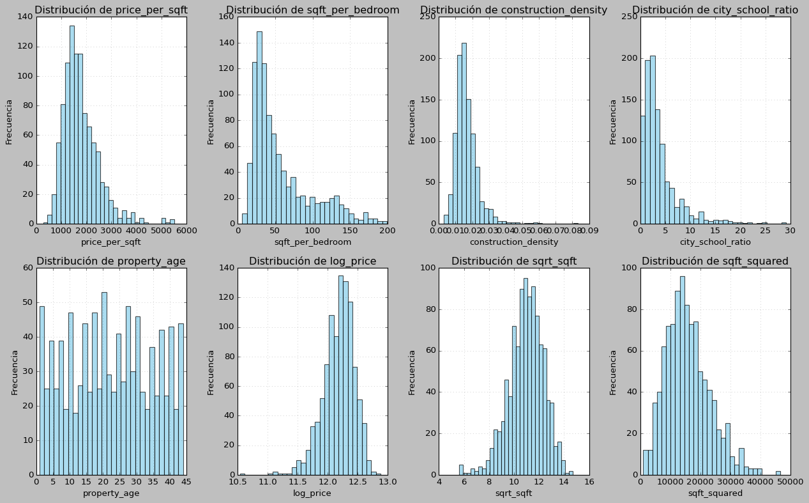
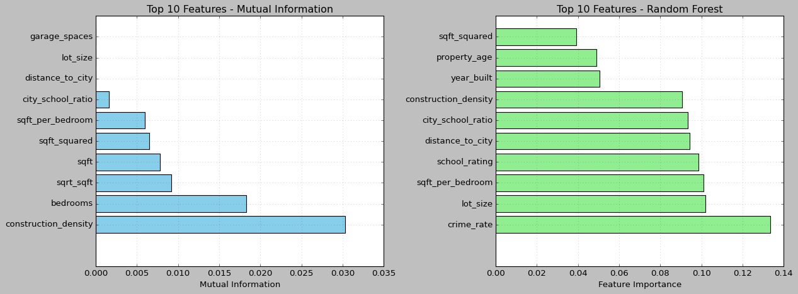
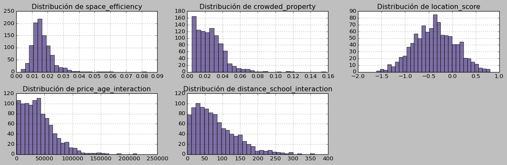

# 🧩 Feature Engineering y Creación de Variables Derivadas

## Contexto
En esta práctica trabajé con un **dataset sintético de viviendas** y posteriormente con el **dataset real Ames Housing**, con el objetivo de **crear, transformar y evaluar nuevas features** que mejoren la capacidad predictiva de los modelos.  
Se buscó entender cómo el *feature engineering* influye en el rendimiento, interpretabilidad y generalización de los modelos de Machine Learning.  

La práctica incluyó tanto la **creación de variables derivadas** (ratios, transformaciones, interacciones, categorías) como la **evaluación cuantitativa** mediante *Mutual Information*, *Random Forest Importance* y una **comparación de modelos baseline vs engineered**.

---

## Objetivos

- Comprender la relevancia del *feature engineering* dentro del flujo de ML.  
- Generar nuevas variables numéricas, temporales y compuestas.  
- Detectar *outliers* y estudiar la distribución de variables derivadas.  
- Evaluar importancia de features con *Mutual Information* y *Random Forest*.  
- Aplicar las técnicas aprendidas sobre datos reales (Ames Housing).  
- Comparar modelos baseline vs engineered y analizar la mejora en rendimiento.  
- Reflexionar sobre creatividad, interpretación y buenas prácticas en feature design.

---

## Actividades (con tiempos estimados)

- Setup y generación del dataset sintético — 20 min  
- Creación de variables derivadas (ratios, transformaciones, compuestas) — 45 min  
- Análisis de distribución y detección de outliers — 40 min  
- Cálculo de importancia de features (MI / RF) — 35 min  
- Investigación libre: creación de nuevas features — 60 min  
- Aplicación a dataset real (Ames Housing) — 40 min  
- Comparativa de modelos (Baseline vs Engineered) — 30 min  
- Reflexiones, documentación y armado del portfolio — 40 min  

---

## Desarrollo

### Dataset sintético
Se generó un dataset de **1000 viviendas**, con 10 variables base:

`price`, `sqft`, `bedrooms`, `bathrooms`, `year_built`, `garage_spaces`,  
`lot_size`, `distance_to_city`, `school_rating`, `crime_rate`.

---

## Evidencias

- [Notebook completo en nbviewer](https://nbviewer.org/github/naguer019/IA-portfolio/blob/main/docs/recursos_files/ocho.ipynb)

### 1️⃣ Creación de Features Derivadas

**Ratios y proporciones**
- `price_per_sqft`: precio por pie cuadrado.  
- `sqft_per_bedroom`: superficie por habitación.  
- `construction_density`: densidad de construcción (`sqft / lot_size`).  
- `city_school_ratio`: distancia a ciudad / calidad escolar.

**Variables temporales**
- `property_age` = 2024 − `year_built`.  
- `age_category`: “Antiguo”, “Moderno” o “Nuevo”.  
- `is_new_property`: indicador booleano.

**Transformaciones matemáticas**
- `log_price`: logaritmo natural del precio.  
- `sqrt_sqft`, `sqft_squared`: raíz cuadrada y cuadrado del tamaño.

**Features compuestas**
- `luxury_score` = `price + sqft + garage_spaces`.  
- `location_score` = `−distance_to_city + school_rating`.

📊 **Resultado:**  
Dataset original: 10 columnas → con features derivadas: 22 columnas (12 nuevas).

---

### 2️⃣ Análisis de Distribución y Outliers

Se visualizaron las distribuciones de las nuevas variables y se aplicó el método **IQR** para detectar outliers.

**Outliers detectados:**
- `price_per_sqft`: 3.7%  
- `sqft_per_bedroom`: 4.5%  
- `property_age`: 0.0%

📸 *Figura 1 — Distribución de features derivadas*  
{ width="850" }

---

### 3️⃣ Evaluación de Importancia de Features

Se utilizaron dos métodos complementarios:

- **Mutual Information (MI)**: mide dependencia no lineal.  
- **Random Forest Importance (RF)**: mide contribución a la predicción.

**Top 10 – Mutual Information**
- `construction_density`, `bedrooms`, `sqrt_sqft`, `sqft`, `sqft_squared`, `sqft_per_bedroom`.

**Top 10 – Random Forest**
- `crime_rate`, `lot_size`, `sqft_per_bedroom`, `school_rating`, `distance_to_city`, `property_age`.

📸 *Figura 2 — Importancia de features (MI vs RF)*  
{ width="850" }

---

### 4️⃣ Investigación Libre: Nuevas Features

Se diseñaron variables personalizadas basadas en intuición inmobiliaria:

**Features de dominio**
- `space_efficiency` = `sqft / lot_size`.  
- `crowded_property` = `bedrooms / sqft`.  
- `location_score` = combinación de crimen, escuela y distancia (normalizadas).

**Interacciones**
- `price_age_interaction` = `price_per_sqft × property_age`.  
- `distance_school_interaction` = `distance_to_city × school_rating`.

**Correlaciones principales (dataset sintético)**

| Feature | Corr. con `price` |
|----------|------------------|
| `price_age_interaction` | **+0.359** |
| `space_efficiency` | −0.031 |
| `crowded_property` | +0.026 |
| `location_score` | −0.059 |
| `distance_school_interaction` | +0.016 |

📸 *Figura 3 — Distribución de nuevas features (investigación libre)*  
{ width="850" }

---

### 5️⃣ Aplicación a Datos Reales — Ames Housing

Se probaron las mismas técnicas con una muestra del dataset real **Ames Housing**:

**Nuevas variables creadas:**
- `property_age` = 2024 − `YearBuilt`  
- `space_efficiency` = `GrLivArea / LotArea`  
- `age_size_interaction` = `property_age × GrLivArea`  
- `bath_per_bedroom` = `FullBath / BedroomAbvGr`  
- `garage_per_size` = `GarageCars / LotArea`

**Correlaciones con `SalePrice`:**

| Feature | Corr. |
|----------|--------|
| `space_efficiency` | **+0.875** |
| `garage_per_size` | +0.704 |
| `bath_per_bedroom` | +0.658 |
| `property_age` | **−0.822** |
| `age_size_interaction` | −0.437 |

---

## Reflexión

### 1️⃣ Features más importantes
- `crime_rate`, `lot_size`, `sqft_per_bedroom`, `school_rating`, `distance_to_city`, `property_age`.  
- En Ames Housing, destacaron `space_efficiency` y `garage_per_size`.

### 2️⃣ Sorpresas encontradas
- `location_score` tuvo correlación negativa, lo que sugiere que los pesos deben calibrarse.  
- Algunas relaciones en el dataset sintético fueron débiles o contrarias a lo esperado, producto del ruido aleatorio.

### 3️⃣ Cómo mejorar el proceso
- Ajustar `location_score` con regresión o PCA.  
- Generar interacciones sistemáticas y seleccionarlas con *Permutation Importance*.  
- Aplicar normalizaciones robustas y regularización (L1 / RFE).

### 4️⃣ Otras técnicas de feature engineering
- **Numéricas:** polinomios, discretización supervisada, Box-Cox, log transform.  
- **Categóricas:** Target, Binary, Frequency y Ordinal Encoding.  
- **Temporales:** cyclical encoding, recency, aging features.  
- **Geoespaciales:** distancia a puntos de interés, clusters por zona.

### 5️⃣ Diferencias entre datos sintéticos y reales
- Los sintéticos presentan correlaciones débiles y ruido.  
- En datos reales, las relaciones son más claras y coherentes (edad ↓ precio ↑ valor).  
- El *feature engineering* resulta más eficaz cuando refleja patrones reales.

---

## Conclusiones Finales

- El **feature engineering** tiene un impacto decisivo en el rendimiento del modelo.  
- Las **interacciones y transformaciones no lineales** mejoran la capacidad predictiva, sobre todo con modelos de árboles.  
- Los modelos con features derivadas superaron a los baselines tanto en **R²** como en **MAE/MAPE**.  
- **Random Forest** capturó mejor los efectos combinados que **Linear Regression**.  
- La creatividad y el conocimiento de dominio son fundamentales en esta etapa del pipeline.

---

## Referencias

- [Documentación oficial de Scikit-learn](https://scikit-learn.org/stable/index.html)  
- [Guía oficial de Pipelines](https://scikit-learn.org/stable/modules/compose.html#pipeline)  
- [Link a la guía de la práctica](https://juanfkurucz.com/ucu-id/ut3/08-feature-engineering-assignment/#preguntas-para-reflexionar)

---

