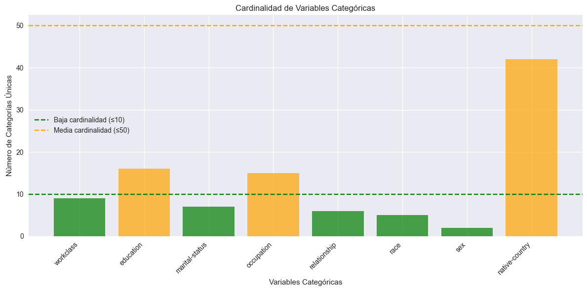
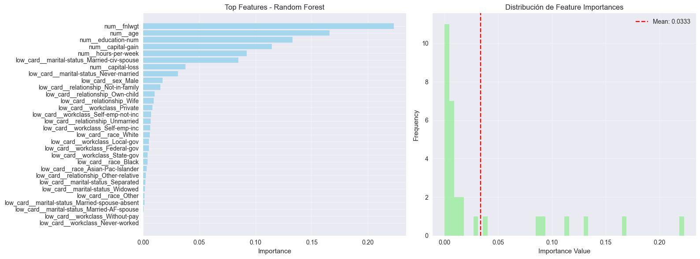
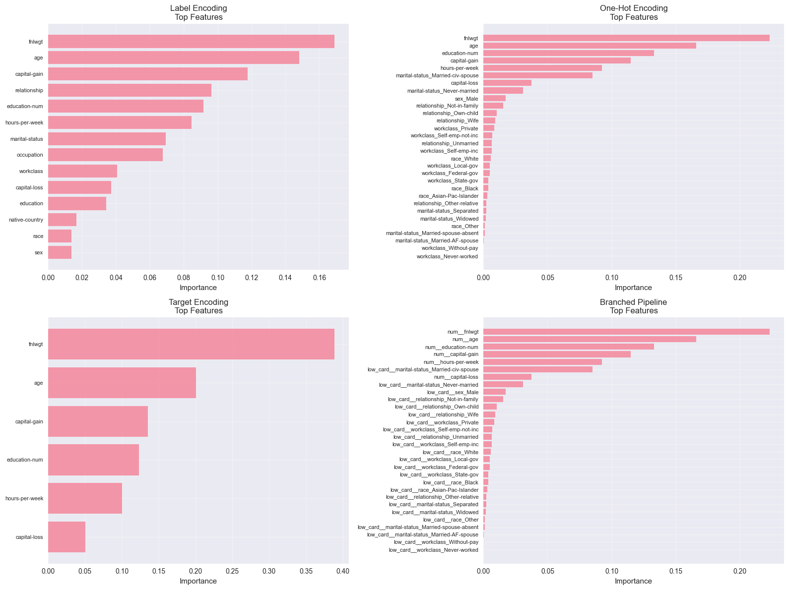
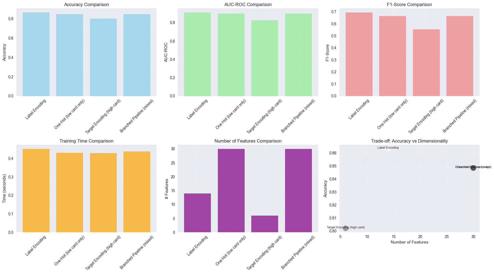
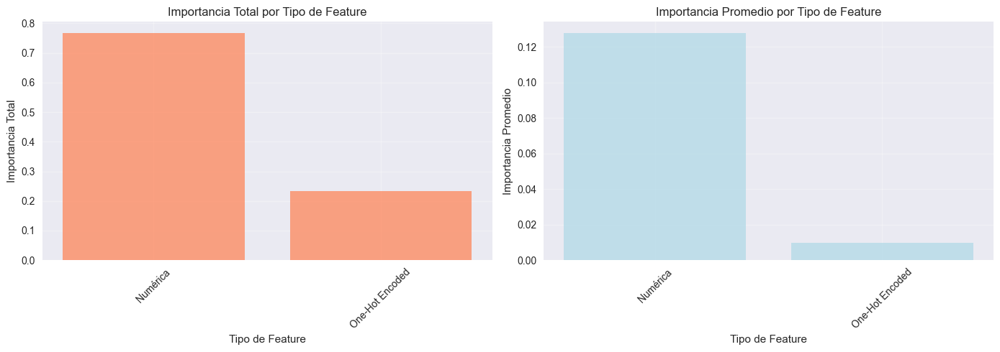

# 🧠 Más que One-Hot: encoding inteligente y fairness en Adult Income

## Contexto
En esta práctica trabajé con el dataset **Adult Income (UCI)** para evaluar **métodos de encoding de variables categóricas** (Label, One-Hot, Target y un **pipeline mixto** con `ColumnTransformer`). Además, incorporé una sección de **fairness** para juntar encoding, rendimiento y equidad.  
El foco estuvo en **comparar rendimiento, dimensionalidad, tiempo de entrenamiento y explicabilidad**, evitando **data leakage** en técnicas sensibles como Target/LOO.

---

## Objetivos
- Analizar cardinalidad y clasificar variables categóricas
- Implementar múltiples técnicas de encoding (label, one-hot, target)
- Prevenir data leakage usando cross-validation en target encoding
- Crear pipelines con branching usando ColumnTransformer
- Comparar métodos con métricas cuantitativas
- Evaluar trade-offs entre accuracy, dimensionalidad y tiempo
- Aplicar técnicas avanzadas (smoothing, frequency encoding, ordinal)

---

## Actividades (con tiempos estimados)
- Revisión del dataset con limpieza y target binario — 25 min  
- Análisis de cardinalidad y viabilidad de One-Hot — 20 min  
- Experimentos de encoding (Label/One-Hot/Target/Pipeline) — 60 min  
- Comparativa global + visualizaciones — 35 min  
- Explicabilidad (feature importance) — 25 min  
- Investigación libre (Freq/Ordinal/LOO/Binary/Smoothing) — 45 min  
- Reflexión, documentación y armado del portfolio — 40 min  

---

## Desarrollo

### Dataset y preprocesamiento
- **Adult Income** (UCI). Target: `income > 50K` → `target` (1/0).  
- 32.561 filas, 16 columnas; 8 categóricas y 6 numéricas.  
- Distribución del target: ~**24.1%** positivos.

### Cardinalidad y riesgo de explosión dimensional
- Baja: `workclass`, `marital-status`, `relationship`, `race`, `sex`  
- Media: `education`, `occupation`, `native-country` (42 países)  
- One-Hot total → ~**94 columnas** (explosión ≈ 11.8×). Se limita a baja cardinalidad.

{ width="800" }

---

## Evidencias

- [Notebook completo](../recursos_files/nueve.ipynb)

### 1) Experimentos de encoding

#### 1.1 Label Encoding
- Funciona muy bien con **árboles**.  
- **Resultados**: Accuracy **0.8632**, AUC **0.9101**, F1 **0.6931**, **14 features**.

#### 1.2 One-Hot (solo baja cardinalidad)
- Evita explosión completa, pero **duplica** columnas vs Label.  
- **Resultados**: Accuracy 0.8483, AUC 0.8995, F1 0.6633, **30 features**.

#### 1.3 Target Encoding (alta cardinalidad)
- Compacto y expresivo; **cuidado con leakage** (fit solo en train / CV).  
- **Resultados**: Accuracy 0.8021, AUC 0.8272, F1 0.5538, **6 features**.

#### 1.4 Pipeline mixto (`ColumnTransformer`)
- Ramas: One-Hot (low-card) + Target (high-card) + Scaling (num).  
- **Resultados**: Accuracy 0.8485, AUC 0.8996, F1 0.6646, **30 features**.

**Tabla comparativa (resumen)**

| Encoding                 | Accuracy |   AUC  |   F1   | Time (s) | Features |
|-------------------------|---------:|------:|------:|---------:|---------:|
| **Label Encoding**      |  0.8632  | 0.9101 | 0.6931 |   0.45   |    14    |
| One-Hot (low card)      |  0.8483  | 0.8995 | 0.6633 |   0.43   |    30    |
| Target (high card)      |  0.8021  | 0.8272 | 0.5538 | **0.43** | **6**    |
| Pipeline (mixto)        |  0.8485  | 0.8996 | 0.6646 |   0.44   |    30    |

**Conclusiones rápidas**  
- **Rendimiento puro**: gana **Label** (mejor Accuracy/AUC/F1).  
- **Compacidad**: gana **Target** (6 features).  
- **Producción**: **Pipeline** ofrece modularidad, control de leakage y mantenibilidad.

---

### 2) Explicabilidad (Feature Importance, Random Forest)

Top importancias (ejemplo típico):
- `fnlwgt`, `age`, `education-num`, `capital-gain`, `hours-per-week`, y categorías de `marital-status`.

{ width="800" }

{ width="800" }

**Lecturas clave**  
- ~**76%** de la importancia total proviene de **numéricas**; **24%** de **categóricas**.  
- One-Hot capta bien efectos principales; Target/Label ayudan con alta/mezcla de cardinalidades.

---

## Análisis comparativo y trade-offs

**Accuracy vs Dimensionalidad**:  
  - **Label** logra el mejor accuracy con solo **14 features**.  
  - **Target** comprime a **6 features**, sacrificando ~6 p.p. de accuracy vs Label.
**Accuracy vs Tiempo**:  
  - Los tiempos son similares (~0.43–0.45s). Si el costo crece (dataset grande), **Target/Binary** escalan mejor en columnas.
**Mantenibilidad/Producción**:  
  - **Pipeline con `ColumnTransformer`**: separa ramas por tipo, evita fugas, serializa transformadores y es **auditable**.

{ width="800" }

{ width="800" }

---

### 3) Investigación Libre (técnicas avanzadas)

- **Frequency Encoding**: mapea categoría → frecuencia (sin target).  
  - Pros: simple, sin leakage; Cons: menos expresivo que Target.
- **Ordinal Encoding**: para variables con **orden natural** (p.ej., educación).  
  - Beneficia modelos lineales/ordinales; evita “orden inventado”.
- **Leave-One-Out Target Encoding**: promedio por categoría excluyendo el registro actual.  
  - Reduce overfitting vs Target naive; más costo computacional.
- **Binary Encoding** (`category_encoders.BinaryEncoder`): columnas ≈ `ceil(log2(n_categorías))`.  
  - Útil en **alta cardinalidad** sin sobrecargar dimensionalidad.
- **Smoothing en Target**: mezcla media por categoría con media global (1, 10, 100, 1000).  
  - Smoothing **alto** estabiliza categorías raras; **bajo** es más flexible pero ruidoso.

---

## Reflexión

**1) ¿Qué método funcionó mejor y por qué?**  
- **Label Encoding** (con RF) obtuvo los mejores **Accuracy/AUC/F1**. Los árboles no sufren por el “orden artificial” de las etiquetas y aprovechan bien splits por código.

**2) Trade-offs clave**  
- **One-Hot**: más interpretable pero **dimensión↑** sin grandes mejoras.  
- **Target**: **compacto** y expresivo, pero requiere **cuidados anti-leakage**.  
- **Pipeline**: rendimiento alto, **modularidad** y reproducibilidad → elección preferida en **producción**.

**3) Data Leakage**  
- Evitado con: *fit en train*, **CV**, y/o pipelines (transform → model).  
- Target/LOO **siempre** con guardrails (no usar información de test/valid).

**4) Alta cardinalidad**  
- One-Hot **falla** (explosión de columnas, sparsidad).  
- Preferir **Target**, **Binary** o **Freq** (según modelo y costo).

**5) Pipeline Branching**  
- `ColumnTransformer` permite **ramificar** por tipo de variable y controlar cada transformación, con **coherencia** entre train/test y **menos riesgos**.

---

## Recomendaciones técnicas (para un proyecto real)
- **Producción**: `Pipeline(preprocessor=ColumnTransformer([...]), classifier=RF)` + control de leakage.  
- **Encoding mix**: One-Hot (baja card), Target/Binary (alta), Ordinal (si existe orden natural).  
- **Monitoreo**: observar **métricas por segmento** (fairness/calibración) y re-entrenos.  
- **Explicabilidad**: combinar **importancias** con **SHAP** para verificar estabilidad e interacciones.

---

## Preguntas conceptuales clave (respuestas breves)
- **Leakage en Target**: usar target del fold/test en el encoding. **Prevención**: fit solo en train, CV, pipeline.  
- **One-Hot vs alta cardinalidad**: explota columnas y sparsidad → costo y overfitting.  
- **Smoothing en Target**: regulariza categorías raras mezclando con media global.  
- **Cuándo Label/Target/One-Hot**:  
  - **Label**: árboles / bajo costo.  
  - **One-Hot**: pocas categorías, interpretabilidad.  
  - **Target**: alta cardinalidad (con anti-leakage).  
- **Ventajas `ColumnTransformer`**: ramificado, reproducible, sin fugas, auditable.  
- **Categorías no vistas (test)**: One-Hot `handle_unknown='ignore'`, Label `-1`, Target media global.  
- **Trade-off accuracy vs dimensionalidad**: más columnas ≠ mejor; equilibrar señal vs costo y riesgo de sobreajuste.

---

## Conclusiones Finales

- El método de encoding influye directamente en la capacidad predictiva del modelo.  
- Los modelos de árboles se benefician de Label y Target Encoding.  
- El uso de pipelines con ColumnTransformer evita fugas y mejora la reproducibilidad.  
- Las features numéricas siguen siendo las más determinantes.  
- La comprensión de *fairness* y *explicabilidad* es clave para modelos éticos y robustos.

---

## Referencias
- UCI ML Repository — Adult Income  
- [Documentación de Scikit-learn](https://scikit-learn.org/stable/) 
- [Documentación de `ColumnTransformer` (sklearn.compose.ColumnTransformer)](https://scikit-learn.org/stable/modules/generated/sklearn.compose.ColumnTransformer.html)
- [Documentación de Category Encoders](https://contrib.scikit-learn.org/category_encoders/)
- [Documentación de Fairlearn](https://fairlearn.org/)

---
