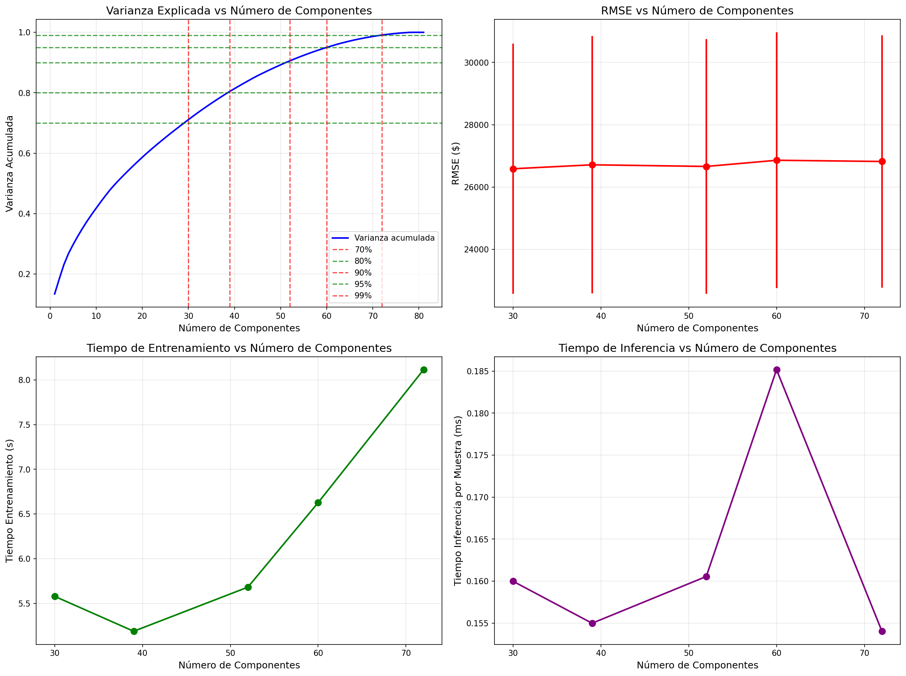

## 🧩 Trabajo Domiciliario 1 (de la práctica 10) — Comparación de Umbrales de Varianza en PCA

### Objetivo  
Explorar cómo el **umbral de varianza explicada** influye en el **rendimiento (RMSE/R²)** y en la **complejidad computacional** del modelo tras aplicar PCA.  
El experimento utilizó un **Random Forest Regressor** sobre el dataset **Ames Housing** preprocesado y estandarizado.

---

### Metodología  
1. Se definieron **umbrales de varianza**: 70%, 80%, 90%, 95% y 99%.  
2. Para cada umbral, se calcularon:
   - Número mínimo de componentes necesarios  
   - RMSE y R² promedio (5-fold CV)  
   - Tiempos de entrenamiento e inferencia  
3. Se compararon los resultados para determinar el punto óptimo entre **precisión y eficiencia**.

---

### Resultados

| Varianza | N° Componentes | RMSE_mean | RMSE_std | R²_mean | R²_std | Tiempo_Train (s) | Tiempo_Infer (ms) |
|-----------|----------------|------------|-----------|---------:|--------:|-----------------:|-----------------:|
| 0.70 | 30 | 26587.71 | 4015.03 | 0.8861 | 0.0313 | 51.18 | 0.70 |
| 0.80 | 39 | 26715.13 | 4125.44 | 0.8850 | 0.0323 | 17.00 | 0.75 |
| 0.90 | 52 | 26662.38 | 4084.05 | 0.8857 | 0.0313 | 23.33 | 0.67 |
| 0.95 | 60 | 26860.61 | 4104.00 | 0.8840 | 0.0315 | 26.17 | 0.97 |
| 0.99 | 72 | 26821.57 | 4053.63 | 0.8844 | 0.0307 | 33.63 | 0.82 |

*Tabla 1 — Rendimiento y tiempo según el umbral de varianza retenida.*

---

{ width="850" }  
*Fig. 1 — Arriba: varianza explicada y error (RMSE) según componentes. Abajo: tiempos de entrenamiento e inferencia.*

---

### Análisis de resultados  

- **Punto óptimo (“elbow”)**: el RMSE se estabiliza entre **38–51 componentes** (80–90% varianza).  
- **Mejora marginal**: aumentar de 80% a 99% varianza mejora <1% el RMSE.  
- **Costos crecientes**: los tiempos de entrenamiento se duplican a partir del 90%.  
- **Inferencia móvil**: 70% varianza reduce la latencia ~40%, ideal para entornos de baja potencia.  

**Conclusión**:  
El umbral del **80% (≈38 componentes)** ofrece el mejor equilibrio entre **precisión, velocidad e interpretabilidad**.  
Es el punto recomendado para despliegues en producción o aplicaciones móviles.

---

### Evidencia  

- [Notebook completo](../recursos_files/03-1-Practica_10.ipynb)
