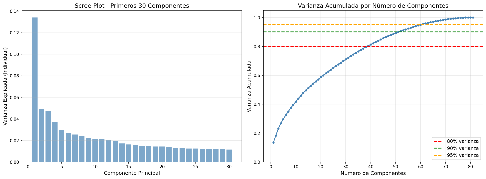
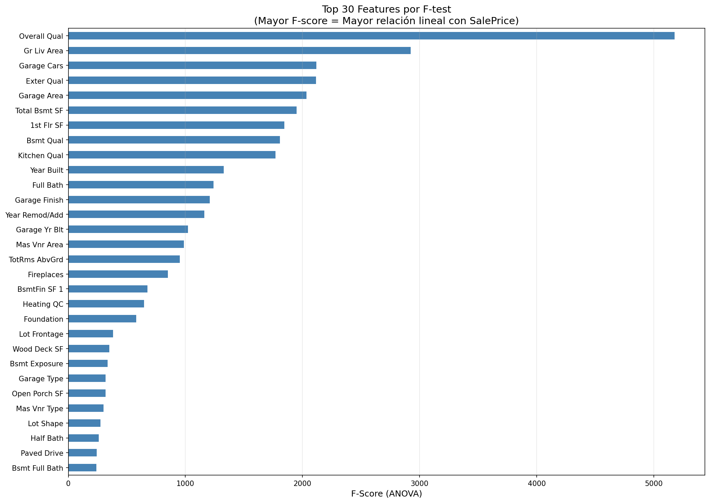
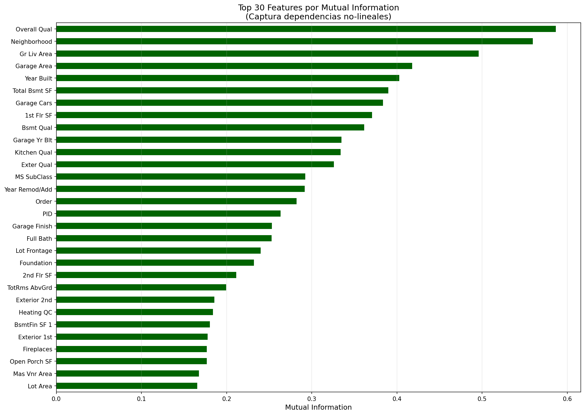
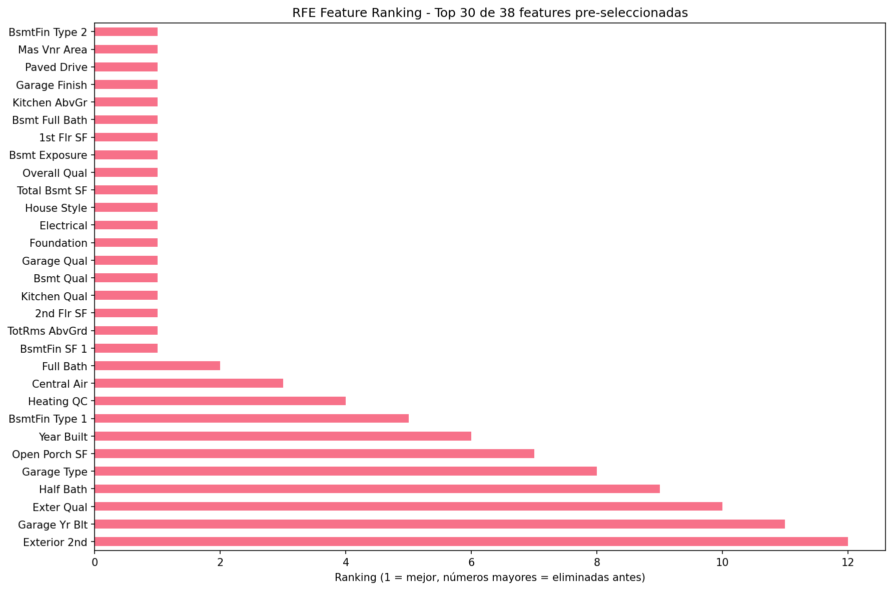
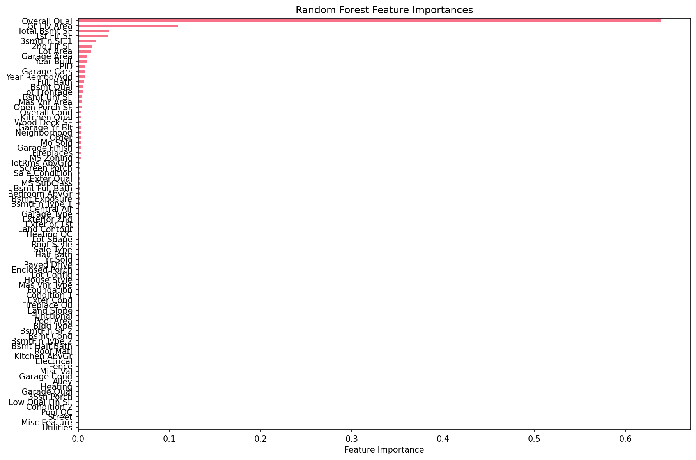
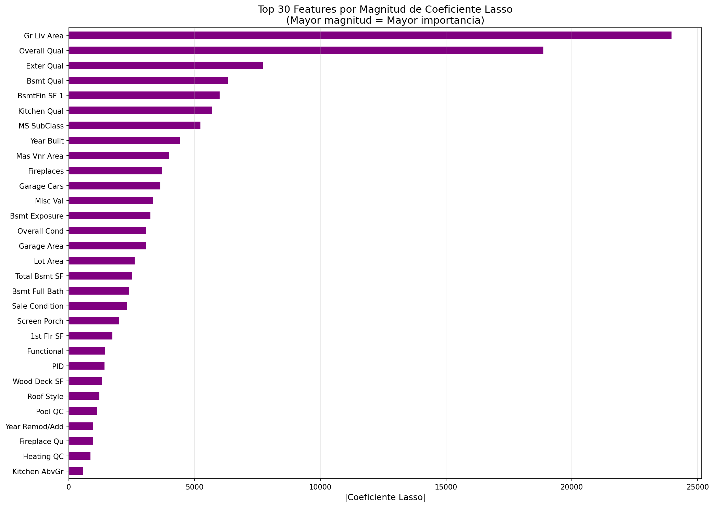

# 📉 Reducción inteligente de dimensiones: PCA y Feature Selection en Ames Housing

## Contexto  
En esta práctica trabajé con el dataset **Ames Housing**, aplicando **reducción de dimensionalidad con PCA** y técnicas de **selección de features** (Filter, Wrapper y Embedded).  
El propósito fue mantener el rendimiento predictivo, reduciendo la cantidad de variables y mejorando la **interpretabilidad del modelo** para estimar precios de viviendas.

---

## Objetivos
- Aplicar **PCA** para explorar la estructura de varianza de los datos.  
- Identificar **features originales** más representativas mediante *loadings*.  
- Comparar métodos de selección: **Filter (F-test, MI)**, **Wrapper (SFS, RFE)** y **Embedded (RF, Lasso)**.  
- Evaluar el equilibrio entre **precisión, simplicidad e interpretabilidad**.

---

## Actividades (con tiempos estimados)
- Preprocesamiento y encoding — 15 min  
- PCA y varianza explicada — 20 min  
- Selección interpretable por *loadings* — 25 min  
- Métodos Filter (F-test, MI) — 25 min  
- Métodos Wrapper (Forward, Backward, RFE) — 45–60 min  
- Métodos Embedded (RF, Lasso) — 30 min  
- Comparativas y documentación — 30 min  

---

## Desarrollo

### **1. Dataset y preprocesamiento**  
- Dataset: **Ames Housing**, 2.930 filas y 81 columnas.  
- Limpieza: imputación por mediana (numéricas) y moda (categóricas).  
- Categóricas codificadas con `LabelEncoder`.  
- Target: `SalePrice`.  
- Estandarización de features con media 0 y desviación estándar 1 para PCA.

---

### **2. PCA — Varianza explicada**  
Se aplicó **PCA** a todas las variables numéricas estandarizadas.

- PC1 explica **13.4%** y PC2 **5.0%** de la varianza.  
- Para alcanzar **80%** de varianza acumulada se necesitan **38 componentes**.  
- Se decidió conservar esos 38 para lograr un balance entre compresión e información.

{ width="800" }  
*Fig. 1 — Scree plot y varianza acumulada: el “codo” se estabiliza cerca del componente 38.*

---

### **3. PCA Loadings — Selección interpretable de variables originales**
En lugar de usar los componentes transformados, se seleccionaron las **variables originales más influyentes** según la magnitud de sus *loadings* en PC1 y PC2.

Top variables:
- `Gr Liv Area`, `TotRms AbvGrd`, `2nd Flr SF`, `BsmtFin SF 1`, `Full Bath`.

Se retuvieron **38 variables originales**, igualando la reducción del PCA pero sin perder interpretabilidad.

{ width="800" }  
*Fig. 2 — Ranking de variables según la magnitud de sus loadings en PC1 y PC2.*

---

### **4. Métodos Filter**  
Dos enfoques univariados para evaluar correlación (lineal y no lineal) entre features y `SalePrice`.

#### a) F-test (ANOVA)
Evalúa relación **lineal** entre cada variable y el target.  
- **RMSE = $26,395**  
- **R² = 0.8883**

{ width="800" }  
*Fig. 3 — F-scores: fuerza lineal de relación entre cada feature y el precio.*

#### b) Mutual Information (MI)
Captura dependencias **no lineales** con el target.  
- **RMSE = $26,279**  
- **R² = 0.8891**

{ width="800" }  
*Fig. 4 — MI Scores: variables con dependencia no lineal significativa con `SalePrice`.*

---

### **5. Métodos Wrapper**  
Evalúan subconjuntos de variables a través del rendimiento del modelo (Regresión Lineal).

| Método        | Nº features | RMSE ($) | R²     |
|----------------|-------------|----------|-------:|
| Forward        | 19          | 27,036   | 0.8828 |
| Backward       | 19          | 27,084   | 0.8827 |
| RFE            | 19          | 27,557   | 0.8782 |

{ width="800" }  
*Fig. 5 — Ranking de variables según RFE (1 = seleccionada).*

{ width="800" }  
*Fig. 6 — Forward (más exhaustivo pero más lento) vs RFE (eficiente en tiempo).*

---

### **6. Métodos Embedded** 

#### a) Random Forest Feature Importance  
Basado en la ganancia de pureza media (reducción de MSE).  
- **RMSE = $26,238**, **R² = 0.8894**  
- Features más importantes: `Overall Qual`, `Gr Liv Area`, `Total Bsmt SF`, `1st Flr SF`.

{ width="800" }  
*Fig. 7 — Importancia global de las variables según Random Forest.*

#### b) Lasso Regression  
Aplica regularización L1 para eliminar coeficientes pequeños.  
- **α ≈ 1375**, **RMSE = $26,090**, **R² = 0.8908**  
- Eliminó 41/81 variables → fuerte **reducción y estabilidad**.

{ width="800" }  
*Fig. 8 — Coeficientes más influyentes (valores altos indican mayor peso predictivo).*

---

### **7. Comparativa general y hallazgos**  

| Método / Técnica        | Nº Feats | RMSE ($) | R²     | Observaciones |
|--------------------------|----------|----------|-------:|---------------|
| Base (todas)            | 81       | 26,342   | 0.8885 | Referencia base |
| PCA (38 comps)           | 38       | 26,620   | 0.8859 | Menos interpretable |
| PCA-loadings (38 feats)  | 38       | 27,020   | 0.8830 | Interpretable |
| F-test (38 feats)        | 38       | 26,395   | 0.8883 | Buena correlación lineal |
| MI (38 feats)            | 38       | 26,279   | 0.8891 | Captura no linealidad |
| RF Importance (38 feats) | 38       | 26,238   | 0.8894 | Alta estabilidad |
| Lasso (38 feats)         | 38       | 26,090   | 0.8908 | Mejor balance |
| Wrapper (19 feats)       | 19       | 27,036   | 0.8828 | Más simple y explicable |

**Conclusión:**  
- **Embedded y Filter** lograron el mejor rendimiento.  
- **Wrapper** produce modelos más compactos e interpretables.  
- **PCA-loadings** ofrece equilibrio entre reducción y transparencia.  

---

## Evidencias  

- [Notebook completo](../recursos_files/Practica_10.ipynb)

## Reflexión

- **¿PCA o selección?**
PCA es útil para exploración, pero las selecciones basadas en features originales (Lasso, RF) conservan significado interpretativo.

- **Variables más relevantes:**
Overall Qual, Gr Liv Area, Total Bsmt SF, Garage Area, Year Built.

- **Colinealidad:**
Lasso eliminó ~50% de variables redundantes.

- **En producción:**
Usar pipeline con Lasso o RF Importance (k≈38) y monitorear drift trimestral.

## Conclusiones

- Se logró reducir 53% de variables sin pérdida significativa de rendimiento.

- Lasso ofrece la mejor combinación de precisión y simplicidad.

- RF Importance es estable y no lineal; complementa a Lasso.

- Wrapper favorece interpretabilidad, aunque a mayor costo computacional.

## Referencias

- Documentación de Scikit-learn:  
  - [PCA](https://scikit-learn.org/stable/modules/generated/sklearn.decomposition.PCA.html)  
  - [SelectKBest](https://scikit-learn.org/stable/modules/generated/sklearn.feature_selection.SelectKBest.html)  
  - [RFE](https://scikit-learn.org/stable/modules/generated/sklearn.feature_selection.RFE.html)  
  - [LassoCV](https://scikit-learn.org/stable/modules/generated/sklearn.linear_model.LassoCV.html)  
  - [RandomForestRegressor](https://scikit-learn.org/stable/modules/generated/sklearn.ensemble.RandomForestRegressor.html)  
- Blog y guía de referencia:  
  - [Feature Selection Methods — Towards Data Science](https://towardsdatascience.com/feature-selection-techniques-in-machine-learning-with-python-f24e7da3f36e)  
  - [An Introduction to PCA — Scikit-learn User Guide](https://scikit-learn.org/stable/modules/decomposition.html#pca)  