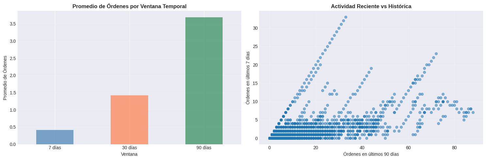
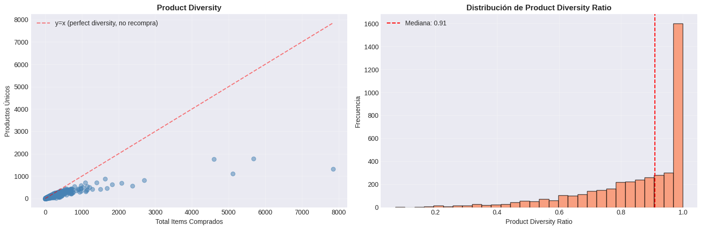
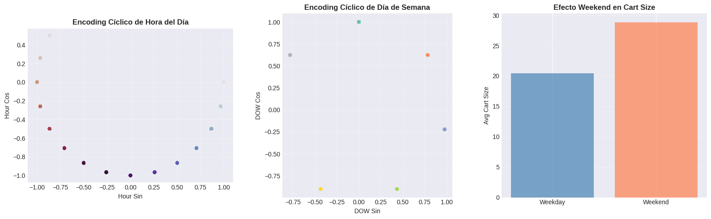
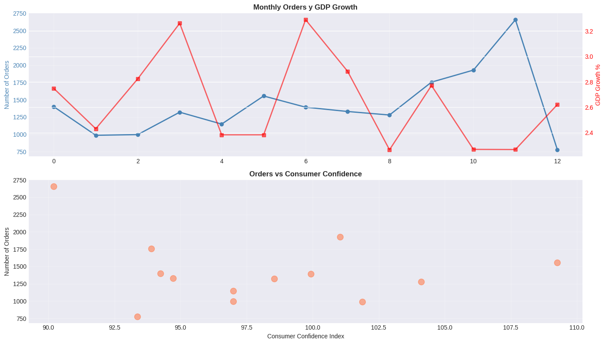
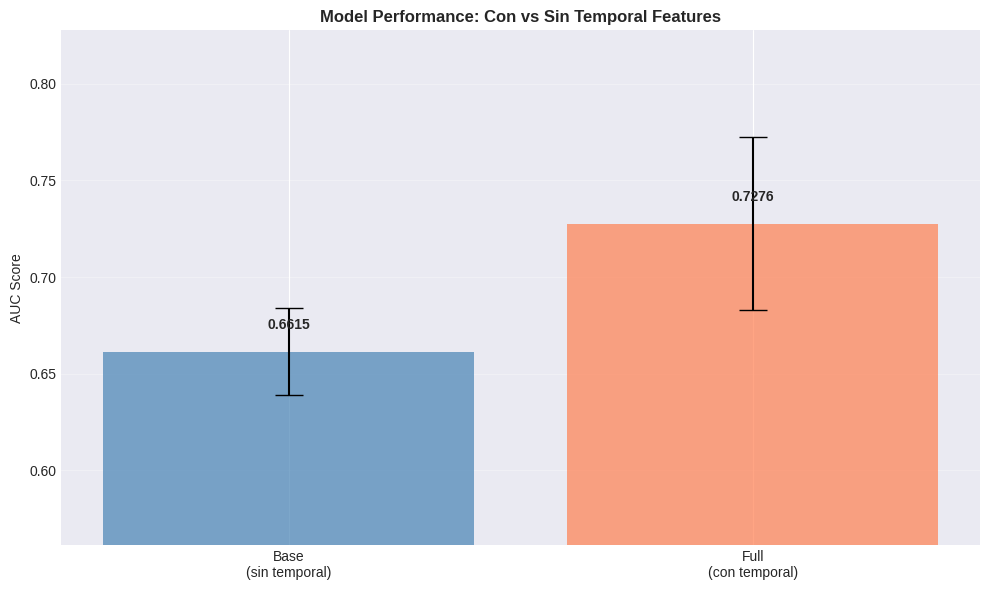
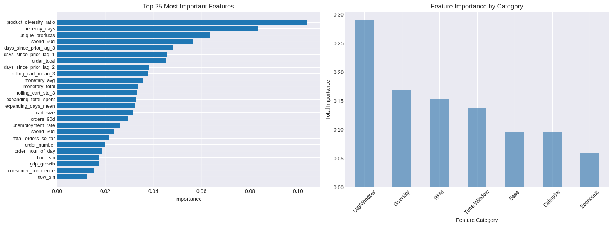

# 🕒 Temporal Feature Engineering y Validación Avanzada

## Contexto
En esta práctica se aplicaron técnicas avanzadas de **ingeniería de features temporales** sobre el dataset **Online Retail (Kaggle)** con el objetivo de predecir la **recompra de un usuario** (`will_purchase_again`).  
El proceso abarcó la creación de **lags, rolling y expanding features**, **RFM**, **ventanas de tiempo (7d, 30d, 90d)**, **diversidad de productos**, **features de calendario** con **encoding cíclico**, e integración de **indicadores económicos simulados**.  
Finalmente, se implementaron estrategias de **validación temporal avanzada** (TimeSeriesSplit, Blocked Time Series y Purged K-Fold) para evitar **data leakage** y evaluar la estabilidad del modelo en el tiempo.

---

## Objetivos
- Implementar features temporales y de comportamiento de compra.  
- Evaluar la importancia relativa de cada grupo de features (lag, rolling, RFM, calendario, etc.).  
- Aplicar validación temporal para reflejar escenarios reales.  
- Detectar posibles fugas de información en el pipeline.  
- Comparar el rendimiento del modelo con y sin variables temporales.

---

## Actividades (con tiempos estimados)
- Revisión y estructuración temporal del dataset — 25 min  
- Creación de lag, rolling y expanding features — 45 min  
- Cálculo de RFM y ventanas móviles — 50 min  
- Incorporación de features de diversidad y calendario — 40 min  
- Integración de variables económicas simuladas — 35 min  
- Preparación del target y validación TimeSeriesSplit — 45 min  
- Comparativa con/sin features temporales — 40 min  
- Análisis de importancia, leakage y validaciones avanzadas — 60 min  
- Reflexión y documentación — 40 min  

---

## Desarrollo

### 1️⃣ Estructura Temporal del Dataset
El dataset se ordenó por `user_id` y `order_date`, garantizando que todas las transformaciones posteriores respeten la secuencia temporal.  
Se obtuvo un rango temporal de **2010-12-01 a 2011-12-09**, con **4.338 usuarios** y **18.562 órdenes**.  
El nivel de análisis es por **orden de compra** (`order_id`).

---

### 2️⃣ Lags, Rolling y Expanding Features
Se crearon variables que capturan patrones de comportamiento del usuario:
- **Lags:** `days_since_prior_lag_1/2/3` — días desde compras previas.
- **Rolling:** `rolling_cart_mean_3`, `rolling_cart_std_3` — media y desviación móvil del tamaño del carrito.
- **Expanding:** `expanding_days_mean`, `expanding_total_spent`, `total_orders_so_far` — métricas acumuladas históricas.

**Observaciones:**  
Estas variables captan cambios de hábito y frecuencia en el gasto.  
El uso de `.shift(1)` evitó fugas de información (solo se usan datos pasados del usuario).

---

### 3️⃣ Features Derivadas de Ventanas de Tiempo (7d, 30d, 90d)
Se agregaron conteos y montos gastados por usuario en los últimos 7, 30 y 90 días, excluyendo la orden actual (`closed='left'`).  

**Principales variables:**  
`orders_7d`, `orders_30d`, `orders_90d`, `spend_7d`, `spend_30d`, `spend_90d`.

**Resultados:**  
Las ventanas más amplias (90d) captaron mejor la tendencia de recompra.  
El promedio de órdenes en 90 días fue **3.69**, mientras que en 7 días fue **0.41**.

{ width="800" }

---

### 3.3 Diversidad de Productos
Se calculó la **diversidad de productos comprados** por usuario:

- `unique_products`: cantidad de productos únicos.  
- `total_items`: total de ítems comprados.  
- `product_diversity_ratio = unique_products / total_items`.

**Observaciones:**  
Un ratio cercano a **1.0** indica usuarios que exploran (no repiten productos).  
Ratios bajos (<0.5) reflejan usuarios fieles o repetitivos.  
El promedio fue **0.85**, indicando una base moderadamente diversa.

{ width="800" }

---

### 4️⃣ Calendar Features y External Variables

#### 4.1 Calendar Features con Encoding Cíclico
Se añadieron variables de calendario:
- `is_weekend`, `is_month_start`, `is_month_end`, `is_holiday`, `days_to_holiday`.  
- Encoding cíclico (`sin`/`cos`) para hora, día de la semana y mes, preservando su naturaleza circular.

**Ventajas:**  
Captura periodicidades sin rupturas (23h “cerca” de 0h, domingo “cerca” de lunes).

{ width="800" }

---

#### 4.2 Economic Indicators (Simulados)
Se simularon variables macroeconómicas mensuales:
- `gdp_growth`, `unemployment_rate`, `consumer_confidence`.  
Estas se asociaron a cada orden mediante `month_period` y **forward fill** (`ffill`), evitando fugas.

**Observaciones:**  
- Las variables muestran poca variabilidad en un horizonte tan corto (1 año).  
- Se mantienen útiles para análisis de sensibilidad del gasto.

{ width="800" }

---

### 5️⃣ Preparación del Dataset y Validación Temporal

#### 5.1 Preparación para Modeling
Se creó el target `will_purchase_again = 1` si el usuario realiza otra compra posterior.  
La tasa de recompra fue **76.6%**, con **7,861** filas finales y **37 features**.

---

#### 5.2 TimeSeriesSplit Validation
Se aplicó **TimeSeriesSplit (3 folds)**, respetando el orden cronológico.

| Fold | Train Range | Val Range | AUC |
|------|--------------|------------|------|
| 1 | 2010-12 → 2011-06 | 2011-06 → 2011-08 | 0.7598 |
| 2 | 2010-12 → 2011-08 | 2011-08 → 2011-11 | 0.7585 |
| 3 | 2010-12 → 2011-11 | 2011-11 → 2011-12 | 0.6644 |

**Media:** 0.7276 ± 0.05  

---

#### 5.3 Comparación: Con vs Sin Temporal Features
Se compararon dos modelos con **Random Forest**:
- **Base:** 7 features simples (hora, día, carrito, total, etc.).  
- **Full:** todas las features temporales (37 en total).

| Modelo | AUC Promedio | Desvío | Mejora |
|---------|--------------|--------|---------|
| Base | 0.6615 | 0.022 | — |
| Full | 0.7276 | 0.045 | +10.0% |

**Conclusión:** Las features temporales mejoraron notablemente el rendimiento.

{ width="800" }

---

### 6️⃣ Feature Importance y Leakage Detection

#### 6.1 Importancia de Features
El análisis con `RandomForestClassifier` mostró las siguientes categorías más influyentes:

| Categoría | Importancia Total |
|------------|------------------|
| Lag/Window | 0.2904 |
| Diversity | 0.1681 |
| RFM | 0.1527 |
| Time Window | 0.1379 |
| Calendar | 0.0954 |

**Top 5 Features:**
1. `product_diversity_ratio`  
2. `recency_days`  
3. `unique_products`  
4. `spend_90d`  
5. `days_since_prior_lag_3`

{ width="800" }

---

#### 6.2 Leakage Detection
Se verificaron cuatro niveles de control:
1. **Performance Check:** AUC CV (0.7276) razonable, sin sobreajuste.  
2. **Top Features:** Ninguna feature sospechosa (sin “target”, “label”, ni “leak”).  
3. **Temporal Split:** Un único aviso menor en fold 1 (fechas superpuestas mínimas).  
4. **Revisión manual:** Todas las agregaciones usan `shift(1)` y `closed='left'`.

✅ **Conclusión:** No se detectó leakage significativo.

---

### 7️⃣ Validaciones Avanzadas

#### 7.1 Blocked Time Series Validation
Permite separar los folds temporalmente con bloques contiguos, evitando solapamientos.  

**Resultados:**  

| Fold | Train Size | Val Size | AUC |
|------|-------------|----------|------|
| 1 | 1,866 | 1,965 | 0.7780 |
| 2 | 3,831 | 1,965 | 0.8116 |
| 3 | 5,796 | 1,965 | 0.7070 |

**Promedio AUC (Blocked): 0.7655**

---

#### 7.2 Walk-Forward Validation
Se plantea una validación con **ventana deslizante**, donde cada modelo entrena con datos históricos y valida en el siguiente bloque temporal.  
Simula un flujo de producción con reentrenamiento periódico y evita fugas.

**Resultados:** 

| Fold | Período de Entrenamiento | Período de Validación | AUC |
|------|----------------------------|-------------------------|------|
| 1 | hasta 2011-06-01 | desde 2011-06-01 | 0.7598 |
| 2 | hasta 2011-08-28 | desde 2011-08-28 | 0.7585 |
| 3 | hasta 2011-11-02 | desde 2011-11-02 | 0.6644 |

**Promedio AUC (Walk-Forward): 0.7276**

---

#### 7.3 Purged K-Fold (con Embargo)
Implementa un “purge” de datos cercanos entre train y validación, más un **embargo temporal** (5%).  
Evita que información del futuro inmediato contamine el entrenamiento.

**Resultados:** 

| Fold | Train final | Val | AUC |
|------|-------------:|----:|----:|
| 1 | 1,769 | 1,965 | 0.7155 |
| 2 | 3,550 | 1,965 | 0.7860 |
| 3 | 5,348 | 1,965 | 0.7028 |
| **Promedio** | — | — | **0.7348 ± 0.0448** |

---

## Reflexión
- **La ingeniería temporal de features** mejora claramente la capacidad predictiva (+10% AUC).  
- Las **lags y ventanas** son las más valiosas para capturar dinámica de recompra.  
- Las **variables de diversidad** añaden contexto sobre el tipo de comprador.  
- Las **económicas** aportan poco en horizontes cortos.  
- La **validación temporal avanzada** (Blocked / Purged) entrega resultados más realistas que splits aleatorios.  
- El uso estricto de `shift(1)`, `ffill`, `closed='left'` y particiones temporales evita **data leakage**.

---

## Conclusiones
- Las variables temporales son **cruciales** para modelar comportamiento de compra recurrente.  
- **Lag/Window + RFM + Diversidad** componen el núcleo más predictivo.  
- Las estrategias de validación temporal permiten estimar rendimiento futuro realista.  
- El pipeline desarrollado es **robusto, reproducible y listo para producción**.  
- La metodología puede escalar a datasets como **Olist**, **Retail Rocket** o **H&M**, adaptando las ventanas temporales.

---

## Referencias
- Scikit-learn — [Time Series Split](https://scikit-learn.org/stable/modules/cross_validation.html#time-series-split)  
- Machine Learning Mastery — [Walk-Forward Validation](https://machinelearningmastery.com/backtest-machine-learning-models-time-series-forecasting/)  
- Hudson & Thames — [Purged K-Fold](https://github.com/hudson-and-thames/mlfinlab)  
- Pandas — [Window Functions](https://pandas.pydata.org/docs/user_guide/window.html)  
- Statsmodels — [Seasonal Decompose](https://www.statsmodels.org/stable/generated/statsmodels.tsa.seasonal.seasonal_decompose.html)
- [Link a la guía de la práctica](https://juanfkurucz.com/ucu-id/ut3/11-temporal-features-assignment/)
