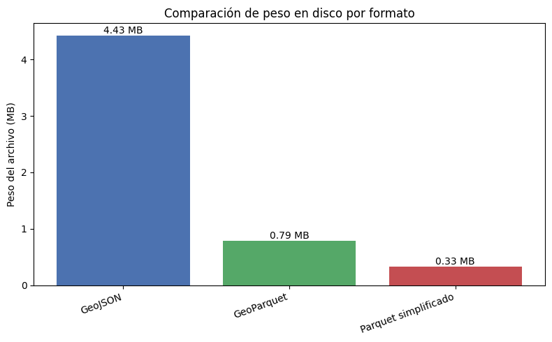
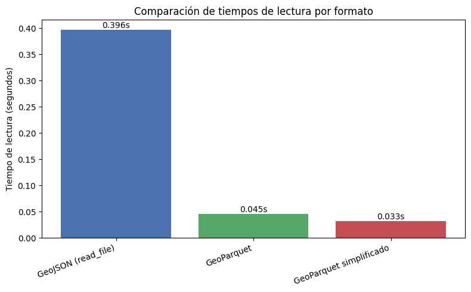

# 🗺️💨 Mapas más rápidos: técnicas para acelerar cargas geoespaciales

Como tarea opcional, evalué **rendimiento de lectura** y **peso en disco** de tres formatos para la misma capa `radios_m`:

1. **GeoJSON original**
2. **GeoParquet**
3. **GeoParquet simplificado** (geometrías con `simplify(tolerance=50)`)

### **Tamaño en MB**

   - GeoJSON original              : 4.43 MB
   - GeoParquet                    : 0.79 MB
   - GeoParquet simplificado       : 0.33 MB

{ width="800" }
*Fig. 1 — Peso de archivo por formato: GeoParquet reduce el tamaño a 0.18× del GeoJSON, y su versión simplificada a solo 0.07×.*

### **Tiempo de lectura**

   - GeoJSON (read_file)           : 0.3964 s
   - GeoParquet (read_parquet)     : 0.0454 s
   - GeoParquet simplificado       : 0.0326 s

{ width="800" }
*Fig. 2 — Tiempo de lectura por formato: el GeoParquet es ~9× más rápido y su versión simplificada supera las 12×.*

Calculé los factores de reducción de tamaño y de aceleración en lectura:

- GeoParquet reduce el tamaño del archivo a ≈18% del GeoJSON.
- GeoParquet simplificado lo lleva aún más abajo, a ≈7% del tamaño original.
- La lectura de Parquet es ≈8.7× más rápida que GeoJSON.
- La lectura de Parquet simplificado alcanza una mejora de ≈12.1×.

En términos prácticos:

- Convertir GeoJSON → GeoParquet reduce el peso unas 5.5 veces y acelera la carga casi 9 veces.

- Si además se simplifican las geometrías, el archivo queda ≈15 veces más liviano que el GeoJSON inicial y la lectura es alrededor de 12 veces más veloz.

### Notebook

- [Notebook completo](../recursos_files/doce_extra.ipynb)