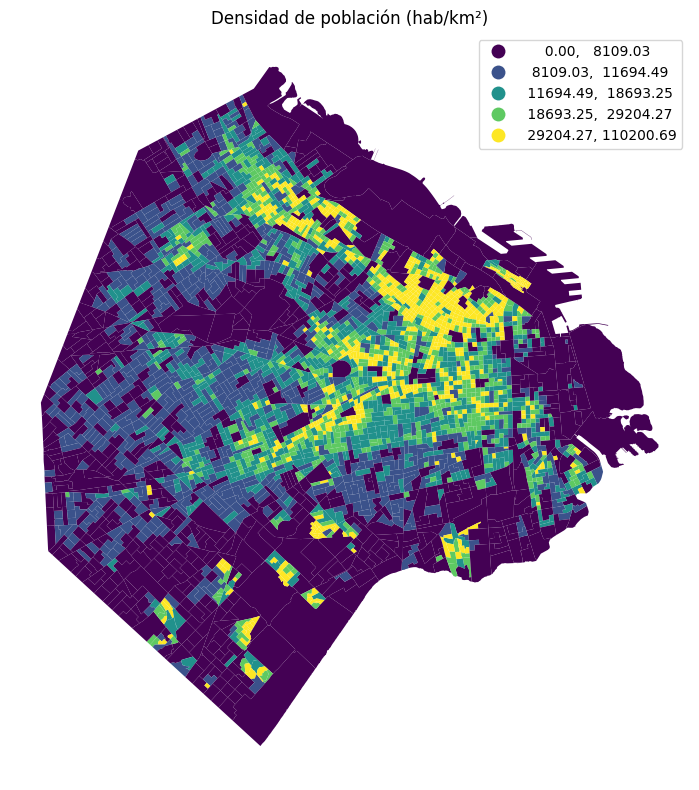
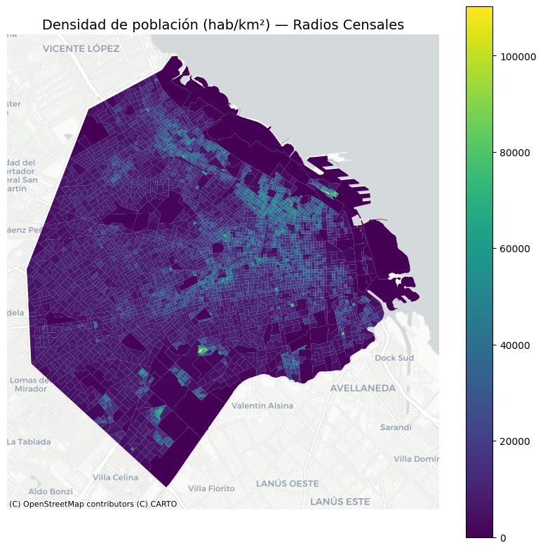
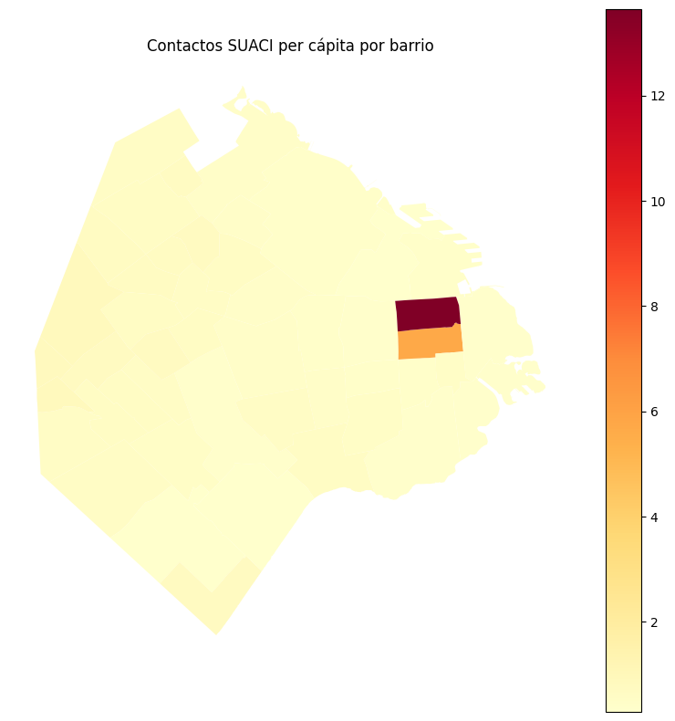
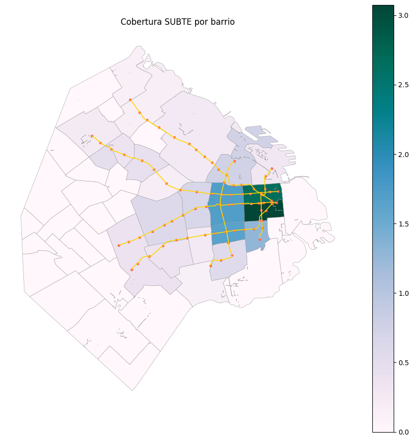
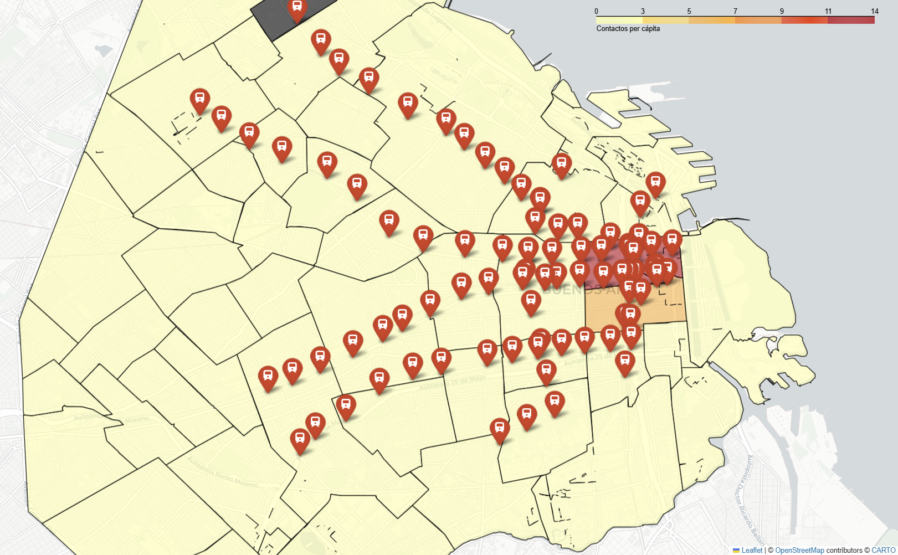

# 🏙️ Radiografía geoespacial de CABA: población, servicios y movilidad

## Contexto  
En esta práctica trabajé con datos geoespaciales de la Ciudad Autónoma de Buenos Aires (CABA) para analizar **densidad poblacional**, **actividad ciudadana (SUACI)** y **cobertura del sistema de subtes**.  
El objetivo fue comprender **cómo se distribuyen la población, los servicios y la movilidad**, aplicando técnicas de SIG con GeoPandas, análisis espacial y visualización geográfica.

---

## Objetivos
- Cargar, validar y proyectar datos espaciales.  
- Calcular áreas reales y densidades en un CRS métrico.  
- Construir coropletas temáticas por radio y por barrio.  
- Integrar información de SUACI (contactos ciudadanos).  
- Analizar la cobertura del SUBTE y distancias mínimas por barrio.  
- Crear un mapa interactivo combinando capas.

---

## Actividades (con tiempos estimados)
- Carga y validación de datos — 10 min  
- Proyección y cálculo de densidades — 15 min  
- Análisis de población (radios y barrios) — 25 min  
- Análisis SUACI per cápita — 20 min  
- Integración SUBTE (estaciones, líneas, distancias) — 35 min  
- Mapa interactivo + documentación — 25 min  

---

# Desarrollo

## 1. Datos y carga inicial

Se cargaron los **radios censales** desde:

https://bitsandbricks.github.io/data/CABA_rc.geojson

- CRS inicial: **EPSG:4326 (WGS84)**  
- Filas: 3554  
- Geometrías nulas/vacías: 0  

---

## 2. Proyección métrica y densidad poblacional

Para obtener áreas reales, los radios se proyectaron a:

- **EPSG:3857 (Web Mercator)**  
- Unidades: metros  

Variables generadas:

- `area_m2` → área real en m²  
- `densidad_hab_km2` → población / área (km²)

---

{ width="800" }  
*Fig. 11.1 — Visualización base de los radios censales en CRS geográfico (EPSG:4326).*

{ width="800" }  
*Fig. 11.2 — Coropleta en esquema quantiles (k=5) mostrando la densidad de población por km².*

{ width="800" }  
*Fig. 11.3 — Densidad poblacional superpuesta sobre azulejos CartoDB Positron.*

---

### Top 3 radios por densidad

| RADIO_ID | Barrio | Área (km²) | Densidad (hab/km²) |
|----------|--------|-----------:|--------------------:|
| 7_17_4 | FLORES | 0.0149 | **110,200** |
| 1_3_16 | RETIRO | 0.0066 | 109,875 |
| 1_3_8 | RETIRO | 0.0073 | 109,194 |

---

### **Preguntas de reflexión**

1) El esquema más informativo fue **quantiles (k=5)** porque distribuye los radios en grupos del mismo tamaño, resaltando contrastes y evitando rangos vacíos.  

2) La variable normalizada fue **POBLACION**, dividiendo por el área en km² para obtener la densidad.

3) Zonas más densas: **Flores** y **Retiro**, claramente visibles en el mapa.

---

## 3. Agregación a barrios y análisis SUACI

Los radios se **disolvieron por BARRIO** sumando población y área total.  
Luego se integró SUACI (contactos totales por barrio).  

Se creó la métrica contactos_pc para ajustar por tamaño poblacional:

contactos_pc = total / POBLACION 

---

{ width="800" }  
*Fig. 11.4 — Tasa de contactos SUACI por habitante, agregada a nivel de barrio.*

---

### Top 3 contactos per cápita

| Barrio | Contactos per cápita |
|--------|----------------------:|
| San Nicolás | **13.64** |
| Monserrat | 5.70 |
| Versalles | 0.90 |

---

### **Preguntas de reflexión**

1) La métrica per cápita evita sesgos por tamaño poblacional, permitiendo comparaciones justas.  
2) Los top-3 son barrios **centrales** con mucha actividad institucional y comercial.  
3) Para segmentar usaría una columna **RUBRO** y tasas por cada 1.000 habitantes.

---

## 4. Cobertura del SUBTE

Se utilizó:

- Líneas del SUBTE  
- Estaciones  
- `sjoin` para conteo por barrio  
- `sjoin_nearest` para calcular distancia mínima (centroides → estación más cercana)

Variables creadas:

- `n_estaciones`  
- `estaciones_por_km2`  
- `dist_min_m` (distancia mínima en metros)

---

{ width="800" }  
*Fig. 11.5 — Densidad de estaciones del SUBTE por km² y trazas de las líneas.*

---

### Barrios con mayor densidad de estaciones

| Barrio | Estaciones | Est./km² |
|--------|------------|---------:|
| Monserrat | 10 | **3.07** |
| San Nicolás | 9 | 2.66 |
| Balvanera | 11 | 1.71 |

---

### Barrios con peor cobertura (distancia mínima)

| Barrio | Distancia (m) |
|--------|---------------:|
| Villa Riachuelo | **6636** |
| Villa Real | 5900 |
| Versalles | 5500 |
| Liniers | 5200 |
| Villa Devoto | 4900 |

---

### **Preguntas de reflexión**

1) Se espera una **correlación directa** entre estaciones_por_km2 y contactos_pc: zonas con mayor actividad urbana tienden a tener más movilidad y más demandas.  

2) El barrio con peor cobertura es **Villa Riachuelo**, en zona periférica.  

3) Criterio propuesto para nuevas estaciones:  
`score = 0.5 · dist_min_m + 0.5 · contactos_pc`.

---

## 5. Mapa interactivo final

Se construyó un mapa con:

- Coropleta SUACI  
- Estaciones del SUBTE como marcadores  
- Tiles “CartoDB Positron”

El mapa interactivo se capturó como imagen.

---

{ width="800" }  
*Fig. 11.6 — Captura del mapa interactivo integrando contactos SUACI y estaciones del SUBTE.*

---

## **Preguntas de reflexión**

1) Capa para toggles: **folium.FeatureGroup** con **LayerControl** → permite encender/apagar capas.  

2) Tiles recomendados para coropletas intensas:  
**CartoDB.PositronNoLabels** o **Esri.WorldGrayCanvas** (fondos neutros).  

3) Popup de estación:  
**Nombre de estación**, **línea**, **barrio**.

---

## Evidencias  

- [Notebook completo](../recursos_files/doce_1.ipynb)

---

# Reflexiones finales

### 1. Impacto del CRS proyectado  
Usar **EPSG:3857** permitió trabajar en **metros**, evitando errores de área/distancia al usar grados geográficos.

### 2. Normalizaciones clave  
Normalizar por km² y per cápita evita que los mapas reflejen solo tamaños poblacionales.  
La métrica más reveladora fue: **contactos per cápita**.

### 3. Peor cobertura del SUBTE  
El caso crítico es **Villa Riachuelo**.  
Podría evaluarse ubicar una estación hacia Av. General Paz y Av. Roca.

### 4. Limitaciones técnicas  
- GeoJSON puede pesar mucho → usar GeoParquet.  
- CSV en ISO-8859-1 → convertir a UTF-8.  
- sjoin puede ser lento → usar índices espaciales (rtree).  

### 5. Checklist de calidad aplicado  
- [x] CRS consistente  
- [x] Geometrías válidas  
- [ ] Índices espaciales (no se configuraron explícitamente índices, se usó el comportamiento por defecto)
- [x] Tests básicos  
- [x] Documentación completa  

---

# Conclusiones

- La densidad poblacional muestra fuertes variaciones entre periferia y microcentro.  
- SUACI revela picos en barrios institucionales, no necesariamente residenciales.  
- El SUBTE concentra su cobertura en el centro, dejando grandes vacíos en el sur y oeste.  
- La integración SIG permitió articular población, reclamos y movilidad en una narrativa coherente.

---

# Referencias

- [GeoPandas](https://geopandas.org)  
- [Contextily](https://contextily.readthedocs.io)  
- [Folium](https://python-visualization.github.io/folium) 
- [Datos](https://bitsandbricks.github.io/data)

