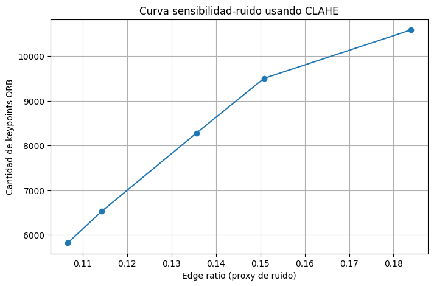

## 📊 CLAHE bajo el microscopio: el delicado equilibrio entre detalles y ruido

En esta tarea se analizó cómo varía la sensibilidad del detector ORB y la cantidad de
bordes detectados por Canny al modificar el parámetro `clipLimit` del algoritmo
**CLAHE**, aplicado sobre el canal **L\*** del espacio LAB.

El objetivo fue estudiar la relación entre:

- **num_keypoints:** cantidad de puntos clave detectados por ORB  
- **edge_ratio:** proporción de píxeles detectados como bordes (proxy de ruido)

Esto permite visualizar cómo el realce de contraste local afecta tanto la detección
de features como el nivel de detalle/ruido estructural en la imagen.

---

### Procedimiento

Para cada valor de `clipLimit` se aplicó el siguiente pipeline:

1. Convertir la imagen a LAB.  
2. Aplicar CLAHE sobre el canal L\*.  
3. Detectar keypoints ORB (con `nfeatures = 15000`).  
4. Detectar bordes con Canny y calcular el `edge_ratio`.  

Los valores evaluados fueron:

[0.5, 1.0, 2.0, 3.0, 5.0]

---

### Resultados obtenidos

| clipLimit | num_keypoints | edge_ratio |
|----------:|--------------:|-----------:|
| 0.5 | 5820  | 0.106674 |
| 1.0 | 6526  | 0.114285 |
| 2.0 | 8276  | 0.135616 |
| 3.0 | 9503  | 0.150867 |
| 5.0 | 10585 | 0.183903 |

Con `nfeatures` a **15000** el detector muestra una variación real y creciente en la sensibilidad según el nivel de contraste local.

---

### Curva sensibilidad-ruido

{ width="800" }  
*Fig. 1 — Incremento conjunto de keypoints y bordes detectados al elevar el clipLimit de CLAHE. La curva revela mayor micro-contraste local.*

---

### Interpretación

El parámetro `clipLimit` controla cuánta redistribución de histograma se permite en
cada región local. A medida que aumenta su valor:

- La imagen presenta **más micro-contraste**,  
- Aparecen nuevas texturas y esquinas,  
- Se incrementa tanto la sensibilidad como el ruido estructural.

Concretamente:

- **num_keypoints aumenta de 5820 → 10585 (+82%)**,  
  indicando que ORB encuentra una mayor densidad de esquinas y estructuras locales.

- **edge_ratio sube de 0.1067 → 0.1839 (+72%)**,  
  señalando que Canny detecta más bordes, algunos de ellos posiblemente ruido.

Ambas métricas crecen de manera aproximadamente monotónica, lo que confirma que un
clipLimit mayor intensifica de forma simultánea la información útil y el nivel de
detalle no deseado.

El análisis de esta curva es útil para determinar un punto de equilibrio: valores
demasiado bajos de `clipLimit` reducen la sensibilidad, mientras que valores altos
aumentan tanto la cantidad de features como el ruido, pudiendo afectar la robustez
en etapas posteriores del pipeline.

---

## Evidencias  

- [Notebook completo (Parte extra al final)](../recursos_files/trece.ipynb)

---

### Conclusión

La curva sensibilidad-ruido muestra claramente el efecto del contraste adaptativo
sobre la detección de features: **más contraste local produce más puntos clave**, pero
también **más ruido estructural**. El balance óptimo dependerá del tipo de aplicación:
si se requiere robustez (matching, tracking), valores intermedios (2–3) ofrecen un
compromiso razonable; para maximizar la sensibilidad o enriquecer el análisis, se
pueden utilizar valores más altos.

Esta tarea permitió cuantificar visualmente este trade-off, mostrando cómo el
preprocesamiento afecta directamente el desempeño de los detectores de puntos clave.