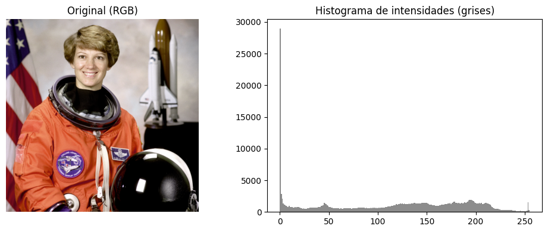
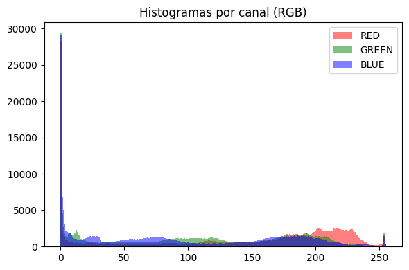
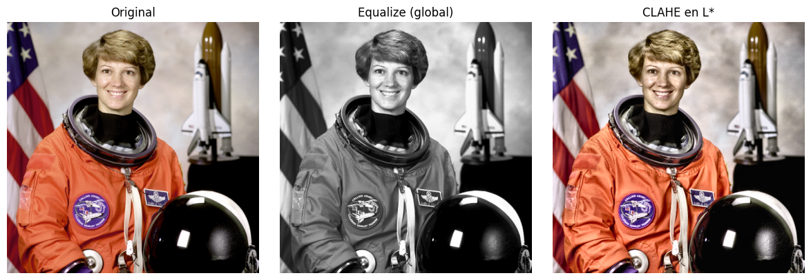
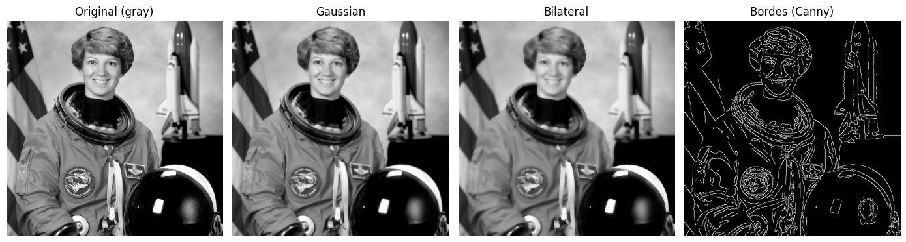
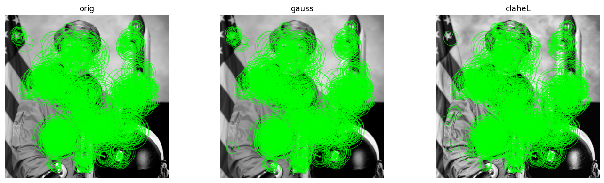
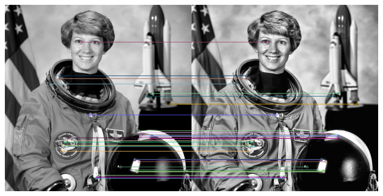

# 🛰️ De píxeles a patrones: realce, bordes y features robustas en imágenes  

## Contexto  
En esta práctica trabajé con un conjunto de imágenes clásicas de `skimage` para construir un recorrido completo de preprocesamiento y análisis de calidad en visión por computador.  
A lo largo del pipeline se exploraron aspectos clave del comportamiento de una imagen:

- su distribución de intensidades,  
- cómo cambia el contraste bajo diferentes técnicas,  
- qué ocurre al suavizar frente a ruido,  
- cómo responden los bordes a esos cambios,  
- y finalmente, cómo se afecta la detección de features locales (ORB) y la repetibilidad de los matches.

---

## Objetivos

- Analizar el rango dinámico, histograma y contraste basal.  
- Comparar ecualización global vs CLAHE aplicados sobre luminancia.  
- Evaluar el efecto de gaussiano y bilateral en el ruido y la estructura.  
- Medir la detección de bordes con Canny y su sensibilidad a parámetros.  
- Extraer features ORB y medir su estabilidad entre variantes.  
- Conectar métricas (STD, var(grad), edge_ratio, matches_ratio) con decisiones prácticas.

---

## Actividades (Tiempos estimados)

- Carga y revisión de imágenes — 10 min  
- Análisis de intensidades e histogramas — 15 min  
- Realce de contraste (Equalize / CLAHE) — 20 min  
- Suavizado y bordes (Gauss / Bilateral / Canny) — 25 min  
- Features ORB y matching — 30 min  
- Síntesis final y documentación — 30 min  

---

## Desarrollo

### 1. Explorando intensidades (Parte A)  
Para comenzar se analizó la imagen original en RGB y su versión en escala de grises, observando el rango dinámico y la distribución tonal.  
La imagen presentaba un rango **0–255**, lo cual indica que está aprovechando completamente el espacio de intensidades típico de 8 bits.

El histograma en grises mostró un **contraste medio-alto**: picos tanto en zonas oscuras como claras, y bastante presencia en los tonos medios.  
En color, el canal **R** (rojo) se mostró dominante, una señal clara de los tonos cálidos del traje del astronauta.

{ width="800" }  
*Fig. 1 — Histograma en escala de grises: la imagen usa todo el rango dinámico y muestra un contraste bien distribuido.*

{ width="800" }  
*Fig. 2 — Histogramas por canal: el canal R (rojo) domina, aportando un tinte cálido general.*

---

### 2. Realce del contraste con Equalize y CLAHE (Parte B)  
Se eligió trabajar sobre espacios de color **HSV** y **LAB**, identificando el canal más informativo para ajustes de luminancia.  
El canal **L*** de LAB fue el más adecuado, ya que concentra el brillo sin mezclar información de color.

Se comparó la ecualización global (que expande agresivamente el histograma) con **CLAHE**, que distribuye el contraste por regiones y evita saturaciones excesivas.  
Los valores de desviación estándar mostraron:

- un aumento fuerte con *Equalize*,  
- y un aumento moderado con *CLAHE*, señal de realce más controlado.

CLAHE tendió a mejorar el contraste sin destruir texturas ni generar artefactos, especialmente útil en imágenes con zonas suaves.

{ width="800" }  
*Fig. 3 — Comparación entre la imagen original, equalize global y CLAHE sobre L\*: la ecualización global maximiza el contraste, mientras que CLAHE lo distribuye suavemente.*

---

### 3. Suavizado y detección de bordes (Parte C)  
Luego se aplicaron dos técnicas de suavizado:

- **Gaussiano:** difumina ruido, pero también bordes débiles.  
- **Bilateral:** atenúa ruido preservando bordes, ya que respeta diferencias de intensidad.

La varianza del gradiente (`var(grad)`) disminuyó en ambas variantes, indicando que el filtrado redujo cambios bruscos de intensidad. Sin embargo, el bilateral mantuvo mejor la estructura.

El uso de **Canny** permitió medir el *edge ratio*:  
- la imagen original tenía un edge ratio **alto**, señal de ruido o texturas no estructurales;  
- ambas variantes suavizadas bajaron los valores a ≈ 0.077;  
- el bilateral produjo bordes más limpios y definidos.

Para escenas nocturnas, sería recomendable usar thresholds más bajos como **(20, 50)**, ya que los contrastes reducidos requieren mayor sensibilidad.

{ width="800" }  
*Fig. 4 — Suavizado: el filtro bilateral conserva mejor los bordes importantes que el gaussiano. Reduciendo el threshold1 a 25 y threshold2 a 55 en el filtro bilateral, se mejoró la detección de bordes notablemente.*

---

### 4. Features locales y matching ORB (Parte D)  
Se analizaron tres variantes:

- original,  
- suavizada (Gauss),  
- y contrastada (CLAHE en L\*).

ORB permitió detectar hasta **1500 keypoints** en todas las variantes.  
La densidad de puntos detectados fue mayor en la versión **CLAHE**, ya que el micro-contraste local resalta texturas y transiciones leves.

El siguiente paso fue emparejar features entre la imagen original y la versión CLAHE.  
El `matches_ratio ≈ 0.57` mostró una **muy buena repetibilidad**, indicando que CLAHE realza puntos significativos sin alterar su geometría.

Si se buscara equilibrar tiempo de ejecución y calidad, parámetros sugeridos serían:

- `nfeatures = 1000`,  
- `scaleFactor = 1.3`.

{ width="800" }  
*Fig. 5 — Detección de keypoints ORB: CLAHE genera más puntos clave por el aumento local del contraste.*

{ width="800" }  
*Fig. 6 — Matching ORB entre la imagen original y CLAHE: alta repetibilidad (≈ 57%).*

---

## Evidencias  

- [Notebook completo](../recursos_files/trece.ipynb)

---

## Reflexión final

1. **Transformación más útil**  
   CLAHE sobre el canal **L\*** fue la más valiosa: mejora el contraste local y mantiene la estabilidad de los detalles sin introducir ruido ni saturaciones.

2. **Canal más informativo (HSV/LAB)**  
   El canal **L** en LAB es el más adecuado para realce de brillo/contraste sin modificar los colores originales.

3. **Trade-off entre suavizado y features**  
   El bilateral reduce ruido sin borrar bordes relevantes, pero puede suavizar texturas útiles para ORB.  
   - menos ruido → bilateral  
   - más detalle → gaussiano suave o sin suavizado

4. **Checks automáticos propuestos**  
   - `num_keypoints < 800` → posible pérdida de detalle  
   - `edge_ratio` fuera de **[0.05, 0.12]** → ruido o sobre-suavizado  
   - `STD < 70` → imagen plana o con mal contraste

---

## Conclusiones

- *Equalize* aumenta el contraste agresivamente; *CLAHE* lo hace de forma controlada y más útil para features.  
- El **filtro bilateral** es superior para preservar bordes sin introducir ruido.  
- ORB responde muy bien a CLAHE, aumentando densidad y estabilidad.  
- Las métricas permiten cuantificar los efectos de cada transformación.  
- El pipeline brinda una vista completa de cómo preparar imágenes para visión por computador.

---

## Referencias

- Documentación oficial de OpenCV:  
  - [Histogram Equalization](https://docs.opencv.org/4.x/d5/daf/tutorial_py_histogram_equalization.html)  
  - [CLAHE (Adaptive Histogram Equalization)](https://docs.opencv.org/4.x/d6/dc7/group__imgproc__hist.html)  
  - [Gaussian Blur](https://docs.opencv.org/4.x/d4/d13/tutorial_py_filtering.html)  
  - [Bilateral Filtering](https://docs.opencv.org/4.x/d4/d86/group__imgproc__filter.html)  
  - [Canny Edge Detector](https://docs.opencv.org/4.x/da/d22/tutorial_py_canny.html)  
  - [ORB — Oriented FAST and Rotated BRIEF](https://docs.opencv.org/4.x/db/d95/classcv_1_1ORB.html)  
  - [BFMatcher (Brute Force Matching)](https://docs.opencv.org/4.x/d3/da1/classcv_1_1BFMatcher.html)

- Documentación de scikit-image:  
  - [Image Processing Overview](https://scikit-image.org/docs/stable/auto_examples/)  
  - [Módulo `skimage.data` (imágenes utilizadas)](https://scikit-image.org/docs/stable/api/skimage.data.html)