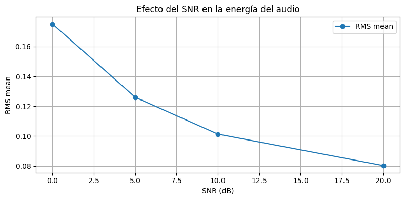
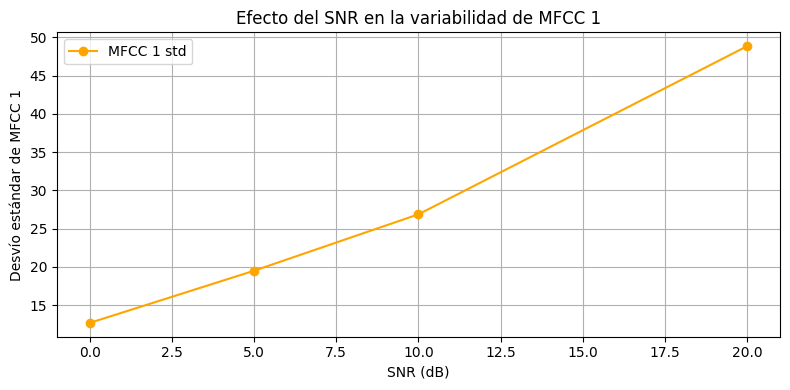
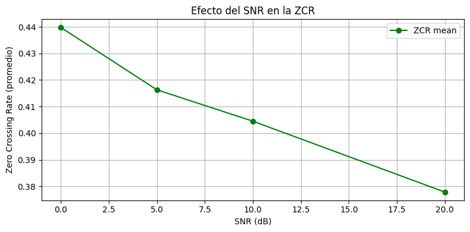
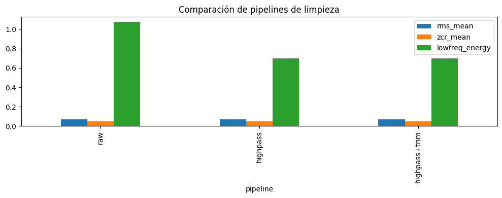
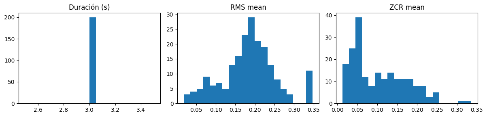
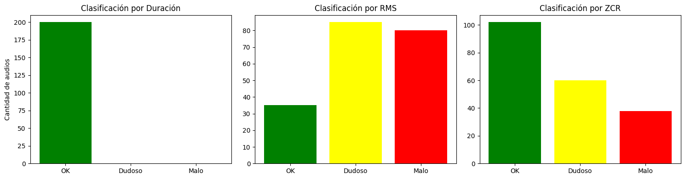

# ⚙️ Noise Lab: Experimentos Avanzados con SNR, Filtros y Métricas de Calidad

## *1 — Sensibilidad de features frente al ruido (SNR)*

Se generaron versiones ruidosas del audio con SNR = 0, 5, 10 y 20 dB.  
Luego se midieron:  
- **RMS mean**  
- **ZCR mean**  
- **MFCC 1 std**  

Tabla generada:

| SNR (dB) | RMS mean | ZCR mean | MFCC 1 std |
|---------:|----------:|----------:|-------------:|
| 0        | 0.175     | 0.440     | 12.67 |
| 5        | 0.126     | 0.416     | 19.50 |
| 10       | 0.101     | 0.404     | 26.87 |
| 20       | 0.080     | 0.378     | 48.85 |

---

{ width="900" }
*Fig. F1 — Efecto del SNR en la energía RMS.*

{ width="900" }
*Fig. F2 — Sensibilidad del MFCC 1 (desvío estándar) frente al ruido.*

{ width="900" }
*Fig. F3 — Cambios en el Zero Crossing Rate según el SNR.*

**Conclusión breve:**  
- **MFCC 1 std** es el feature más afectado por ruido → excelente detector de degradación.  
- **RMS** disminuye cuando sube el SNR.  
- **ZCR** cae porque el ruido blanco produce muchos cruces por cero.

---

## *2 — Benchmark de pipelines de limpieza*

Se compararon tres pipelines:

1. `raw`  
2. `highpass (80 Hz)`  
3. `highpass + trim`

Se evaluaron RMS, ZCR y una métrica propuesta:  
**Low-frequency energy (0–200 Hz)**.

Tabla:

| Pipeline        | RMS mean | ZCR mean | Lowfreq energy |
|-----------------|----------|----------|----------------|
| raw             | 0.07199  | 0.04993  | 1.07525 |
| highpass        | 0.07199  | 0.04993  | 0.69894 |
| highpass+trim   | 0.07199  | 0.04993  | 0.69894 |

---

{ width="900" }
*Fig. F4 — Comparación de los pipelines raw, highpass y highpass+trim usando RMS, ZCR y energía en bajas frecuencias.*

**Conclusión breve:**  
- El mejor pipeline es **highpass + trim** → reduce ruido de baja frecuencia sin modificar otras features.  
- La métrica lowfreq_energy es útil para comparar calidad.

---

## *3 — Dashboard de Control de Calidad (QA)*

Se procesaron 200 audios y se midieron:

- **Duración** (esperado: 3.0 s)  
- **RMS mean**  
- **ZCR mean**

### Histogramas

{ width="900" }
*Fig. F5 — Histogramas de duración, RMS y ZCR para 200 audios procesados.*

### Clasificación semáforo (OK / Dudoso / Malo)

Resultados:

**Duración**
- OK: 200  
- Dudoso: 0  
- Malo: 0  

**RMS**
- OK: 35  
- Dudoso: 85  
- Malo: 80  

**ZCR**
- OK: 102  
- Dudoso: 60  
- Malo: 38  

{ width="900" }
*Fig. F6 — Clasificación tipo semáforo para Duración, RMS y ZCR.*

**Conclusión breve:**  
- La **duración** está perfectamente controlada.  
- **ZCR** muestra variabilidad moderada.  
- **RMS** es la métrica con más problemas: indica diferencias grandes en energía.

---

## Resumen Final

- **1:** MFCC 1 std es el mejor indicador de ruido.  
- **2:** Pipeline óptimo → **highpass + trim**.  
- **3:** El dashboard QA muestra buena consistencia en duración, pero energía (RMS) muy variable.

---

## Evidencias

- [Notebook completo (Extra al final)](../recursos_files/14-audio.ipynb)