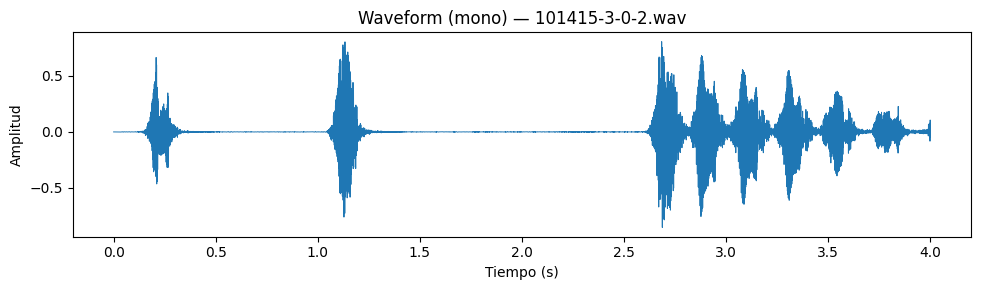
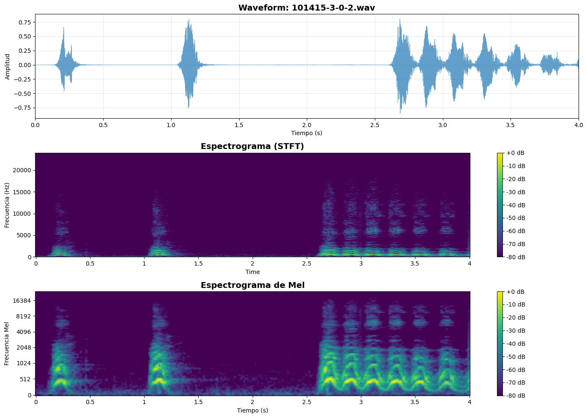
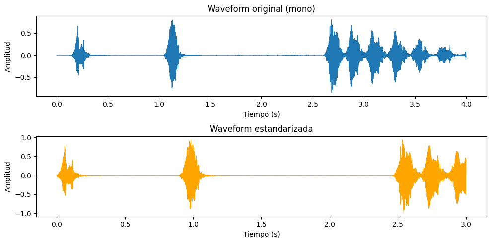
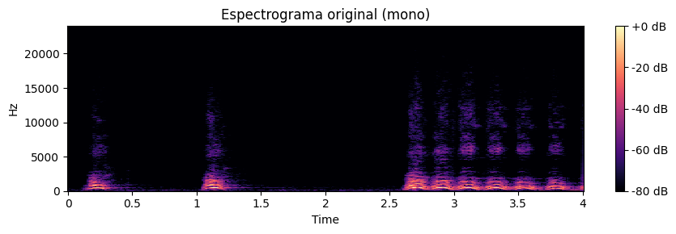
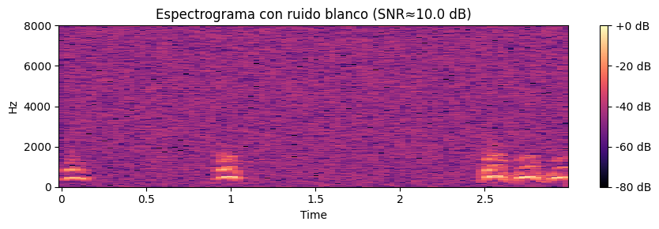
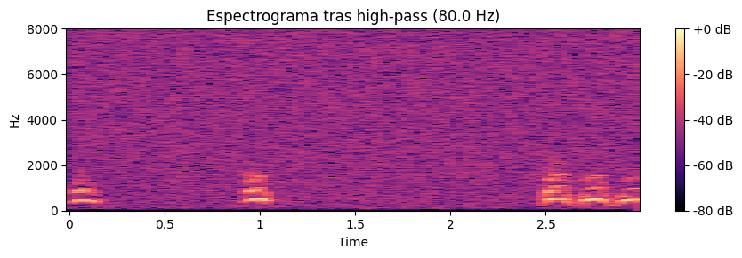
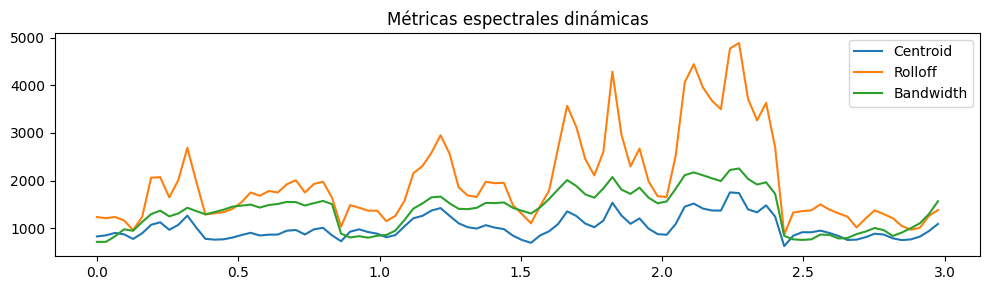
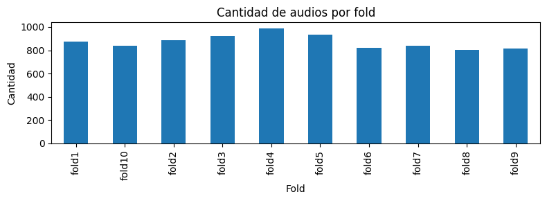
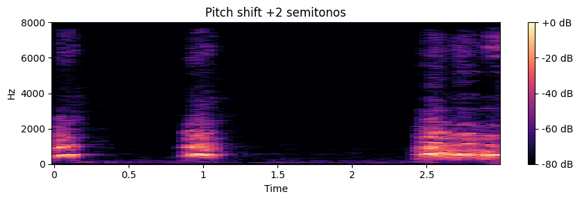
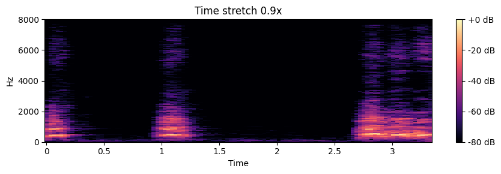

# 🔊 Escuchando la ciudad: preprocesamiento de audio y MFCC en UrbanSound8K

## Contexto  

En esta práctica trabajé con el dataset **UrbanSound8K** (sonidos urbanos etiquetados en 10 clases), descargado desde Kaggle mediante `kagglehub`.  
El objetivo general fue diseñar un **pipeline de preprocesamiento de audio** que deje todos los clips en un formato estándar y extraer **representaciones espectrales y MFCCs** para futuros modelos de clasificación de audio.

A diferencia de prácticas anteriores centradas en imágenes, acá el foco estuvo en:
- pasar de la **señal cruda en el tiempo** a representaciones **tiempo–frecuencia** y
- resumir el audio en **features tabulares** listos para Machine Learning.

---

## Objetivos

- Cargar y explorar un clip del dataset **UrbanSound8K** (waveform y estadísticas básicas).
- Definir un **estándar de entrada**: sample rate, duración fija, normalización y mono.
- Comparar **espectrogramas** antes y después del preprocesamiento.
- Analizar el efecto de **ruido blanco** y de filtrado **high-pass** sobre el espectro.
- Extraer **MFCCs y métricas de energía** y guardarlas en un **CSV**.
- Explorar métricas espectrales dinámicas, la distribución de folds y ejemplos de **data augmentation** (pitch shift y time stretch).

---

## Actividades (con tiempos estimados)

- Descarga del dataset y exploración básica de archivos — 15 min  
- Visualización inicial (waveform + espectrogramas STFT / Mel) — 25 min  
- Diseño del pipeline de preprocesamiento (trim, resampleo, padding, normalización) — 30 min  
- Experimentos con ruido blanco y filtro high-pass — 30 min  
- Extracción de MFCCs y construcción del CSV de features — 30 min  
- Exploraciones avanzadas (métricas espectrales, folds, augmentations) — 30 min  
- Documentación de resultados y reflexiones — 30 min  

---

## Desarrollo

### 1. Dataset y carga de audio

El dataset se descargó con `kagglehub` desde:

- **Dataset:** `chrisfilo/urbansound8k`  
- **Ruta local:** `~/.cache/kagglehub/datasets/chrisfilo/urbansound8k/versions/1`  
- **Cantidad de audios encontrados:** **8732 clips** (`*.wav`).

Para la exploración inicial tomé el primer archivo:

- `101415-3-0-2.wav`  
- Sample rate original: **48000 Hz**  
- Duración: **4.0 s**  
- Canales: **1 (mono)**  
- Tipo de dato: **float32**  
- Rango de amplitud: **[−0.8535, 0.8065]**  
- Media ~0.0 y desviación estándar ≈ 0.1133.

Trabajar en **mono** es suficiente para clasificación de sonidos urbanos: reduce la complejidad y el tamaño de los datos a la mitad y, en este contexto, la información estéreo no es crítica.

En cuanto a la amplitud, los valores están entre ~−0.85 y 0.81, es decir, **no está normalizada** al rango completo [−1, 1], y tampoco hay evidencia de clipping (no hay picos cercanos a ±1.0 saturados).

{ width="800" }  
*Fig. 1 — Forma de onda mono del clip 101415-3-0-2.wav: se observan tres eventos impulsivos y un bloque de actividad más larga al final.*

Para entender mejor la estructura temporal y frecuencial del clip, se generó una visualización combinada:

- **Waveform** en el tiempo.
- **Espectrograma STFT** (frecuencia lineal en Hz).
- **Espectrograma de Mel** (frecuencias en escala perceptual).

{ width="900" }  
*Fig. 2 — Arriba, waveform; al medio, espectrograma STFT; abajo, espectrograma de Mel. Los primeros segundos son golpes aislados y, entre 2.5–4 s, un sonido más continuo y modulando en altura.*

> Nota conceptual: valores cercanos a ±1.0 de forma constante indicarían **clipping**, que produce distorsión no lineal y pérdida irreversible de información. En este clip no se observa ese problema.

---

### 2. Estandarización del audio

Para poder entrenar modelos en lote, se definió un **formato estándar de entrada**:

- `TARGET_SR = 16000 Hz`  
- `TARGET_DURATION = 3.0 s`  
- Señal en **mono**  
- Amplitud normalizada con pico ≈ **0.99**  
- Recorte de silencios con `top_db = 30 dB`.

El pipeline de preprocesamiento aplicado a cada clip fue:

1. **Cargar audio** en su sample rate original.  
2. Si hay múltiples canales, promediar a **mono**.  
3. **Recortar silencios** con `librosa.effects.trim(y, top_db=30)`.  
4. **Resamplear** a 16 kHz si es necesario.  
5. **Ajustar duración** a 3 segundos:
   - Si sobra audio: se recorta.
   - Si falta: se hace padding con ceros al final.  
6. **Normalizar amplitud** para que el valor absoluto máximo sea ≈ 0.99.

Tras este proceso, el clip quedó:

- Forma: 48000 muestras  
- Sample rate: 16000 Hz  
- Duración: **3.0 s**  
- Rango de amplitud: **[−0.99, 0.93]**.

{ width="900" }  
*Fig. 3 — Arriba, waveform original de 4 s; abajo, waveform estandarizada a 3 s, 16 kHz y amplitud normalizada.*

**Justificación de parámetros clave:**

- **16 kHz** es un estándar común en voz y audio para ML: cubre bien el rango de interés (frecuencias útiles hasta 8 kHz, por Nyquist) y reduce el tamaño respecto a 44.1/48 kHz (~2.7× menos muestras).
- El recorte de silencios con `top_db = 30` elimina principalmente **silencios suaves y ruido de fondo**, sin afectar las partes de alta energía del evento.
- La normalización a pico 0.99 **aprovecha mejor el rango dinámico** y hace comparables los clips, sin introducir clipping.
- Si la duración estándar fuera **5.0 s** en lugar de 3.0 s, cada clip pasaría de 48000 a 80000 muestras (16 kHz), aumentando significativamente el tamaño en disco y el costo de procesamiento, aunque permitiendo capturar eventos más largos.
- Recortar siempre desde el **centro del clip** (en lugar de al inicio) podría ser útil si el evento principal suele estar centrado en el audio, pero requiere más lógica; para UrbanSound8K, el recorte por duración después del trim resulta razonable.

---

### 3. Espectrogramas, ruido y filtrado

Para analizar el contenido frecuencial se generaron espectrogramas STFT con:

- `n_fft = 2048`  
- `hop_length = 512`  

lo que implica:

- Ventanas de **128 ms** (`2048 / 16000`)  
- Avance entre ventanas de **32 ms** (`512 / 16000`).

Comparando el espectrograma original y el estandarizado se observa que:

- La estructura general de los eventos se mantiene.  
- El estandarizado concentra la energía en los 3 s elegidos y se limita al rango de 16 kHz (en lugar de 24 kHz de la versión original a 48 kHz).

{ width="900" }  
*Fig. 4 — Espectrograma original (4 s, 48 kHz). Se aprecia energía en frecuencias bajas y medias, con actividad intensa en el último segundo.*

{ width="900" }  
*Fig. 5 — Espectrograma del audio estandarizado (3 s, 16 kHz). El contenido principal se conserva dentro del nuevo rango de frecuencias.*

#### Ruido blanco (SNR ≈ 10 dB)

Se añadió **ruido blanco** con una relación señal-ruido objetivo de **10 dB**, calculando la potencia de la señal y ajustando la potencia del ruido en consecuencia.  

En el espectrograma, el ruido blanco se observa como:

- un “tapizado” uniforme de energía en casi todas las frecuencias,  
- sin patrones estructurados,  
- elevando el suelo de ruido en todo el espectro.

{ width="900" }  
*Fig. 6 — Espectrograma del audio estandarizado con ruido blanco (SNR ≈ 10 dB): fondo más “granulado” que oculta parte de los detalles finos.*

#### Filtro high-pass (80 Hz)

Luego se aplicó un filtro **high-pass Butterworth de 4º orden** con corte en **80 Hz**, pensado para eliminar ruidos muy graves (vibraciones, rumbles, etc.).

{ width="900" }  
*Fig. 7 — Espectrograma después del filtro high-pass a 80 Hz: se atenúan las componentes de muy baja frecuencia, manteniendo prácticamente intacta la señal útil.*

Comentarios:

- La mayoría de sonidos urbanos y voces tienen energía relevante por encima de ~100 Hz, por lo que un corte en 80 Hz **elimina principalmente ruido de muy baja frecuencia**.
- Para eliminar **hum de red (50/60 Hz)** sería más adecuado un **filtro notch** muy selectivo en 50 o 60 Hz (y, si es necesario, en sus armónicos) en lugar de un high-pass agresivo que podría eliminar componentes graves útiles.
- Cambiar a `n_fft = 1024` y `hop_length = 256` mejoraría la **resolución temporal** (ventanas de 64 ms), a costa de peor resolución en frecuencia y mayor cantidad de frames.

---

### 4. Extracción de MFCC y features tabulares

Para pasar de representaciones tiempo–frecuencia a una vista **tabular** apta para modelos clásicos, se extrajeron **MFCCs** y otras métricas:

- **13 coeficientes MFCC** por frame (`n_mfcc = 13`).  
- Para cada coeficiente `i`, se guardaron:
  - `mfcc_i_mean` y `mfcc_i_std`.  
- Además:
  - `rms_mean` (energía media RMS).  
  - `zcr_mean` (tasa de cruces por cero media).

En total, cada clip queda resumido en:

- `13 × 2 = 26` features de MFCC  
- `+ 2` features adicionales (RMS, ZCR)  
- `+ 3` metadatos (`filename`, `sr`, `duration_sec`)  

para un total de **31 columnas** en el DataFrame resultante.

Se procesaron los primeros **100 audios** del dataset con el pipeline estándar y se guardaron las features en:

- `outputs/features/audio_mfcc_features.csv`  
- Shape del DataFrame: **(100, 31)**.

**Justificación de n_mfcc = 13:**

- Es un valor estándar en tareas de **voz** y audio en general.  
- Coeficientes adicionales (14, 15, …) capturan detalles muy finos que pueden ser más **ruido** que información útil.  
- Aumentar dimensionalidad sin suficiente cantidad de datos incrementa el riesgo de **sobreajuste**.

El primer coeficiente (`mfcc_1_mean`) está fuertemente asociado con la **energía global** del espectro (similar a un log-energía). Los coeficientes superiores describen la forma del espectro y su “textura”.

Para usar este CSV en modelos supervisados, faltaría:

- Enriquecerlo con **etiquetas de clase** y metadatos (fold, id de la grabación).  
- Aplicar un escalado tipo **StandardScaler** para que todas las columnas tengan media 0 y varianza 1, evitando que los MFCCs de gran magnitud dominen sobre ZCR o RMS.

---

### 5. Exploraciones avanzadas

#### 5.1 Métricas espectrales dinámicas

Se calcularon y graficaron tres métricas a lo largo del tiempo:

- **Spectral Centroid** (centroide, “brillo” del sonido).  
- **Spectral Rolloff (0.85)**, frecuencia por debajo de la cual se acumula el 85% de la energía.  
- **Spectral Bandwidth**, ancho de banda espectral.

{ width="900" }  
*Fig. 8 — Evolución temporal de centroid, rolloff y bandwidth. Las zonas con energía más brillante y compleja muestran picos en estas curvas, especialmente en el tramo final del clip.*

Estas curvas ayudan a entender cómo cambia el contenido espectral a lo largo del tiempo y podrían servir como features agregadas adicionales.

#### 5.2 Distribución de audios por fold

Se calculó la cantidad de clips por fold (carpeta padre de cada archivo):

{ width="800" }  
*Fig. 9 — Recuento de audios por fold de UrbanSound8K: la distribución es bastante equilibrada, con valores entre ~800 y ~990 clips por fold.*

Esto confirma que UrbanSound8K fue construido con folds relativamente balanceados, útil para validación cruzada.

#### 5.3 Data augmentation: pitch shift y time stretch

Como exploración de **augmentations** se aplicaron:

- **Pitch shift +2 semitonos** sobre el audio estandarizado.  
- **Time stretch 0.9×** (audio levemente más lento).

Se volvieron a generar espectrogramas para observar los cambios:

{ width="900" }  
*Fig. 10 — Espectrograma con pitch shift de +2 semitonos: las bandas de energía se desplazan hacia frecuencias algo más altas, manteniendo la estructura temporal.*

{ width="900" }  
*Fig. 11 — Espectrograma tras time stretch 0.9×: el patrón temporal se estira, alargando levemente la duración efectiva del evento sin modificar demasiado el contenido frecuencial.*

Estas transformaciones son útiles para aumentar la diversidad del dataset sin cambiar la etiqueta de la clase.

---

## Evidencias

- [Notebook completo](../recursos_files/14-audio.ipynb)

---

## Reflexión

- **Estándar de entrada:**  
  El pipeline final dejó todos los audios en **16 kHz**, **3 s**, mono y amplitud normalizada. Esto simplifica enormemente el entrenamiento, reduce tamaño y asegura coherencia entre muestras.

- **Paso que más mejoró la calidad perceptual:**  
  El **recorte de silencios** (`trim`) fue el cambio más positivo: elimina porciones sin información útil y ruido de fondo de muy baja energía, aumentando la relación señal-ruido efectiva sin distorsionar la parte importante del audio.

- **Ruido en el espectrograma:**  
  El **ruido blanco** agregado se aprecia como energía uniforme en casi todo el espectro, sin patrones claros. Es una buena referencia para entender cómo se ve una señal ruidosa en comparación con el patrón estructurado del evento sonoro.

- **Checks automáticos propuestos para QA:**  
  - SNR aproximado > **15 dB**.  
  - Duración efectiva del clip ∈ [2.5 s, 3.5 s].  
  - `max(|amplitud|) ≤ 1.0` para evitar clipping.  
  - Número de frames MFCC > cierto mínimo (por ejemplo, 30) para asegurar resolución temporal.  
  - Centroid y ZCR dentro de rangos razonables (evitar clips casi silenciosos o puramente ruido).  
  Estos checks funcionarían como un “semáforo” de preprocesamiento antes de lanzar el entrenamiento.

---

## Conclusiones

- Se definió y aplicó un **pipeline consistente** de preprocesamiento de audio (mono, 16 kHz, 3 s, normalizado) sobre UrbanSound8K.
- Los **espectrogramas STFT y de Mel** permiten visualizar claramente dónde están los eventos sonoros y cómo se distribuye la energía en frecuencia.
- La experimentación con **ruido blanco** y un filtro **high-pass** mostró cómo limpiar ruidos de baja frecuencia sin perder contenido útil.
- Se extrajeron **MFCCs y métricas de energía** para 100 audios, generando un CSV de 31 columnas adecuado para modelos de ML.
- Las exploraciones avanzadas (métricas espectrales dinámicas, análisis de folds y augmentations) reforzaron la idea de que el preprocesamiento de audio no solo limpia datos, sino que también diseña **representaciones más informativas** para el aprendizaje supervisado.

---

## Referencias

- Documentación de librosa:  
  - [librosa.core.load](https://librosa.org/doc/latest/generated/librosa.load.html)  
  - [librosa.display.specshow](https://librosa.org/doc/latest/generated/librosa.display.specshow.html)  
  - [librosa.feature.mfcc](https://librosa.org/doc/latest/generated/librosa.feature.mfcc.html)  
  - [librosa.effects.trim](https://librosa.org/doc/latest/generated/librosa.effects.trim.html)  
  - [librosa.effects.time_stretch](https://librosa.org/doc/latest/generated/librosa.effects.time_stretch.html)  
  - [librosa.effects.pitch_shift](https://librosa.org/doc/latest/generated/librosa.effects.pitch_shift.html)  

- Dataset:  
  - [UrbanSound8K (Kaggle)](https://www.kaggle.com/datasets/chrisfilo/urbansound8k)

- Procesamiento de señales:  
  - [scipy.signal.butter](https://docs.scipy.org/doc/scipy/reference/generated/scipy.signal.butter.html)  
  - [scipy.signal.lfilter](https://docs.scipy.org/doc/scipy/reference/generated/scipy.signal.lfilter.html)
